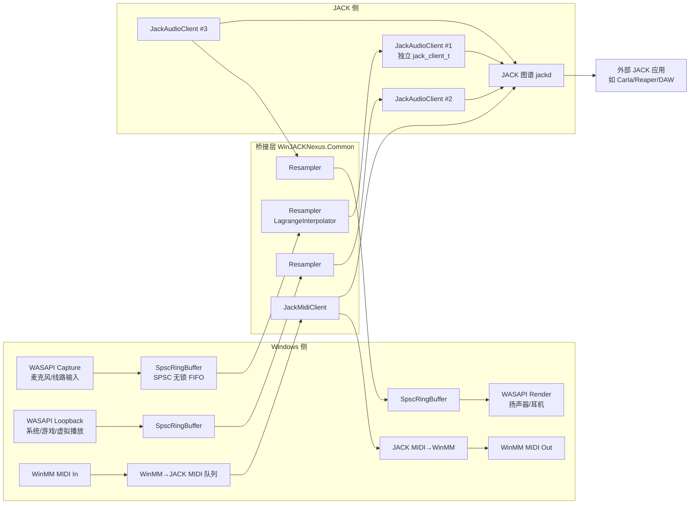

# WinJACK Nexus - Adapter 模块核心开发与落地执行计划书

> **版本**：1.0　**日期**：2026-08-10　**状态**：已批准
>
> **文档定位**：WinJACKNexus 套件首个核心独立模块 `WinJACKNexus.Adapter` 的工业级开发与落地执行计划书。全面总结 Windows WDM 与 JACK 接口解耦、实时无锁架构、线程安全及动态节点管理的讨论成果，并给出 CMake 目录结构、C++ 数据结构定义、UI 布局伪代码、`.adapter` JSON 样例与开发时间表评估。

---

## 目录

- [0. 前置说明与已核实事实](#0-前置说明与已核实事实)
- [一、项目命名与工程架构规范](#一项目命名与工程架构规范)
- [二、视觉语言与视觉标准（16 进制颜色规范）](#二视觉语言与视觉标准16-进制颜色规范)
- [三、界面结构设计（Tab 布局规范）](#三界面结构设计tab-布局规范)
- [四、推进阶段与子里程碑（Milestones）](#四推进阶段与子里程碑milestones)
- [五、C++ 数据结构定义](#五c-数据结构定义)
- [六、UI 布局伪代码](#六ui-布局伪代码)
- [七、.adapter JSON 样例](#七adapter-json-样例)
- [八、开发时间表评估](#八开发时间表评估)
- [九、验证与验收汇总](#九验证与验收汇总)
- [十、风险与缓解措施](#十风险与缓解措施)

---

## 0. 前置说明与已核实事实

### 0.1 工作区现状
- 项目当前为全新仓库，尚无 `WinJACKNexus.Common` 或 `WinJACKNexus.Adapter` 源码。
- 仅存在 `third_party/` 依赖目录（`JUCE` / `JACK2` / `vst3sdk`）。

### 0.2 依赖路径核实（实测）
- JACK2 开发库：`third_party\JACK2\lib\libjack64.lib` ✅（另有 `libjacknet64.lib`、`libjackserver64.lib`）
- JACK2 头文件：`third_party\JACK2\include\jack\`（16 个头文件：`jack.h`、`midiport.h`、`ringbuffer.h`、`types.h`、`weakjack.h`、`session.h`、`metadata.h` 等）✅
- 实际运行**不需要** `libjack64.dll`（静态链入导入库，服务端为外部独立 `jackd`）。

### 0.3 关键 JACK2 API 核实（代码中确证）
| API | 位置 | 用途 |
|---|---|---|
| `jack_client_open` / `jack_client_close` | `jack.h` | 创建/销毁 Client |
| `jack_set_process_callback` | `jack.h` | 注册实时 process 回调 |
| `jack_port_register` / `jack_port_rename` | `jack.h`(913) | 注册/重命名 Port |
| `jack_get_sample_rate` / `jack_set_sample_rate_callback` | `jack.h` | 采样率查询与变更通知 |
| `jack_set_buffer_size_callback` | `jack.h` | 缓冲长度变更通知 |
| `jack_set_xrun_callback` | `jack.h` | Xrun（断音）回调 |
| `jack_activate` / `jack_deactivate` | `jack.h` | 激活/停用 Client |
| `jack_midi_event_write` / `jack_midi_clear_buffer` / `jack_midi_get_event_count` / `jack_midi_event_get` / `jack_midi_event_reserve` | `midiport.h` | MIDI 事件读写 |
| `jack_client_rename` | —（**不存在**） | → Client 重命名采用「关闭重建」策略 |

> ⚠️ 注意：本 JACK2 头文件**未提供** `jack_client_rename`，因此 Client 动态重命名采用「停用 → 关闭 → 以新名重建 → 恢复 Port 连接」策略；重名冲突由 JACK2 服务端自动追加 `_01` 后缀。

### 0.4 已确认决策
| 决策项 | 结论 |
|---|---|
| 计划书交付 | 落盘为工作区 `.md`（本文件，位于 `docs/`） |
| JACK 服务端模式 | 外部独立 `jackd`（JACK2 Windows） |
| 构建工具链 | CMake + MSVC（VS2022）+ Ninja，JUCE 走 `add_subdirectory` |
| 运行依赖 | 不依赖 `libjack64.dll`，仅链入 `libjack64.lib` |

---

## 一、项目命名与工程架构规范

### 1.1 总体架构（纯 Backend 原则）
1. **套件总名称**：`WinJACKNexus`
2. **首开发模块**：`WinJACKNexus.Adapter`（独立的单实例 GUI 应用程序）
3. **跨模块共享库**：`WinJACKNexus.Common`（无锁环形缓冲区封装、自定义 JSON 序列化工具、JUCE 与 libjack 的 Bridge 抽象类、16 进制 UI 主题样式库）
4. **纯粹 Backend 限制**：除 Windows 侧接入 WDM/WASAPI/WinMM 外，系统内部所有音频与 MIDI 接口**仅支持原生 JACK Backend**（依赖 `libjack` C API）。
5. **独立 Client 架构**：每个被添加的 Windows 设备（物理/虚拟、音频/MIDI）都独立注册为一个标准的 JACK Client（**一设备一 Client**，绝不合并为单一 Client）。

### 1.2 数据流总览



- **WASAPI Capture → JACK Output Port**：麦克风/线路输入
- **WASAPI Loopback → JACK Output Port**：系统/游戏 Playback 抓取
- **WASAPI Render ← JACK Input Port**：扬声器/耳机
- **WinMM MIDI In → JACK MIDI Output Port**：物理键盘/LoopMIDI
- **WinMM MIDI Out ← JACK MIDI Input Port**：外部音源/虚拟端口

### 1.3 Client 命名规则
- **默认命名**（严格规律、语义化，按类型内自增）：
  - 音频输入：`WDM_AudioIn_01`、`WDM_AudioIn_02` …
  - 音频输出：`WDM_AudioOut_01` …
  - MIDI 输入：`WDM_MidiIn_01` …
  - MIDI 输出：`WDM_MidiOut_01` …
- **自定义命名**：支持 GUI 实时重命名 Client 名字，并同步更新 JACK 图谱节点名（关闭重建策略，见 0.3）。
- **重名冲突**：由 JACK2 服务端自动追加自增后缀（`_01`），符合 prompt 约定。

### 1.4 极简初始预置
- 首次启动或新建空白配置：**默认仅预置一个 Physical Out 物理扬声器/耳机设备**（自动绑定系统默认渲染设备）。
- **绝不**自动扫描并堆砌全量设备；其余物理/虚拟通道均由用户在 GUI 上按需手动添加。

### 1.5 配置存档系统
- 配置文件自定义扩展名：`.adapter`（如 `Studio_Live.adapter`）。
- 底层结构：**标准、人类可读、易于解析的 JSON 格式**。
- 内容：所有 Client 映射关系、自定义名称、通道配置、设备 GUID、采样率重采样选项。

### 1.6 单实例保护（Single-Instance）
- Windows 命名互斥量：`WinJACK_Nexus_Adapter_Lock`（Named Mutex）。
- 全局仅能运行一个 GUI 实例；重复启动时自动唤醒并置顶已存在窗口。
- 实现：`CreateMutexW` + 共享窗口句柄（注册消息/`FindWindow`）唤醒已有实例。

### 1.7 顶层 CMake 目录结构

```text
WinJACKNexus/
├── CMakeLists.txt                        # 顶层：集成 JUCE + 两模块
├── .gitignore
├── README.md
├── docs/
│   └── WinJACKNexus.Adapter_开发计划书.md  # 本计划书
├── third_party/
│   ├── JUCE/                             # add_subdirectory 集成
│   ├── JACK2/
│   │   ├── include/jack/                 # 头文件（16 个）
│   │   └── lib/libjack64.lib             # 导入库（运行时不需 dll）
│   └── vst3sdk/                          # 本模块不使用
└── modules/
    ├── WinJACKNexus.Common/              # 跨模块共享库
    │   ├── CMakeLists.txt
    │   ├── include/WinJACKNexus/Common/
    │   │   ├── UI/
    │   │   │   ├── Theme.h               # 16 进制颜色常量（§二）
    │   │   │   ├── NexusLookAndFeel.h/.cpp
    │   │   │   ├── AudioLed.h/.cpp       # 音频矢量 LED（Peak Hold 1.5s）
    │   │   │   └── MidiLed.h/.cpp        # MIDI 矢量 LED（80ms 指数衰减）
    │   │   ├── IO/
    │   │   │   ├── SpscRingBuffer.h      # SPSC 无锁环形缓冲
    │   │   │   └── Resampler.h           # LagrangeInterpolator 封装
    │   │   ├── Bridge/
    │   │   │   ├── JackClientBase.h      # libjack 封装抽象基类
    │   │   │   ├── JackAudioClient.h/.cpp
    │   │   │   └── JackMidiClient.h/.cpp
    │   │   ├── Serialization/
    │   │   │   └── AdapterConfig.h/.cpp  # .adapter JSON schema
    │   │   ├── Audio/
    │   │   │   ├── WasapiAsyncDevice.h/.cpp   # juce::AudioDeviceManager 封装
    │   │   │   └── WinMidiListener.h/.cpp     # WinMM 监听
    │   │   └── App/
    │   │       └── SingleInstanceGuard.h/.cpp # Named Mutex
    │   └── tests/                         # Common 单元测试（可选）
    └── WinJACKNexus.Adapter/              # 独立 GUI 应用
        ├── CMakeLists.txt
        ├── Resources/                     # 图标、托盘资源
        └── Source/
            ├── Main.cpp
            ├── App/
            │   ├── AdapterApplication.h/.cpp   # JUCEApplication + 单实例
            │   └── AdapterMainWindow.h/.cpp    # 主窗口 + 系统托盘
            ├── UI/
            │   ├── MainComponent.h/.cpp        # 顶层 3 Tab + In/Out 分割
            │   ├── CascadeDeviceSelector.h/.cpp # 4 层级联菜单
            │   ├── DeviceItemCard.h/.cpp        # 设备卡片
            │   ├── DeviceLedPanel.h/.cpp        # 卡片内 LED 组合
            │   └── TabPages/
            │       ├── PhysicalAudioTab.h/.cpp
            │       ├── VirtualAudioTab.h/.cpp
            │       └── SystemMidiTab.h/.cpp
            ├── Model/
            │   ├── DeviceNode.h/.cpp           # 设备数据模型
            │   └── DeviceRegistry.h/.cpp       # 动态节点管理
            └── Engine/
                └── RealEngine.h/.cpp           # 阶段二真实引擎
```

### 1.8 构建环境规范
- CMake（VS2022 MSVC）+ Ninja；JUCE 通过 `add_subdirectory(third_party/JUCE)` + `juce_add_gui_app` / `juce_add_library` 集成。
- `libjack64.lib` 以导入库形式链入 `WinJACKNexus.Common`（`target_link_libraries` + 头文件 include 目录）。

---

## 二、视觉语言与视觉标准（16 进制颜色规范）

项目界面采用**工业级暗黑数字机架（Dark Rack Unit）**风格，所有 UI 元素颜色绘制**必须严格遵循**以下 16 进制颜色代码：

### 2.1 基础色板
| 语义 | Hex | 用途 |
|---|---|---|
| 主背景色（Dark Canvas） | `#121316` | 极深灰黑主背景，降低视觉疲劳 |
| 面板/卡片背景（Rack Panel） | `#1A1C23` | 深蓝灰机架面板 |
| 边框与分割线（Borders & Dividers） | `#2A2D3A` | 暗金属质感边框 |
| 主文本/高亮字（Primary Text） | `#E6E8EE` | 冷白主文本 |
| 次要文本/标注（Secondary Text） | `#8A8F9E` | 灰蓝标注 |
| Tab 激活状态（Active Tab Indicator） | `#3B82F6` | 科技蓝激活指示 |

### 2.2 音频 LED 状态灯颜色
| 状态 | Hex | 语义 |
|---|---|---|
| 未连接/熄灭（Off） | `#22252D` | 暗灰 |
| 已连接/静音待机（Dim Green） | `#064E3B` | 深绿 |
| 正常音频信号/动态发光（Active Green） | `#10B981` | 高亮翡翠绿 |
| 信号预警（Warning） | `#F59E0B` | 高亮琥珀黄 |
| 严重过载削波/挂留（Clipping Peak Hold） | `#EF4444` | 高亮警示红，触发后悬停 1.5 秒淡出 |

### 2.3 MIDI LED 状态灯颜色
| 状态 | Hex | 语义 |
|---|---|---|
| 未连接/熄灭（Off） | `#22252D` | 暗灰 |
| 已连接待机（Dim Blue） | `#1E3A8A` | 深蓝 |
| MIDI 活动脉冲（Activity Pulse） | `#06B6D4` | 高亮电光青，随 MIDI 节奏 80ms 指数衰减闪烁 |

### 2.4 主题实现约定
- 颜色常量集中于 `WinJACKNexus.Common/UI/Theme.h`，以 `juce::Colour` 静态常量（或命名空间内 `constexpr`）导出，全部 UI 组件**不得硬编码色值**。
- `NexusLookAndFeel` 覆盖：窗口背景、面板填充、边框、Tab 激活指示、TextEditor 焦点高亮（`#3B82F6`）、滚动条等，与 `Theme.h` 保持一致。

---

## 三、界面结构设计（Tab 布局规范）

顶层采用**大类型分 Tab 页**架构，每个 Tab 页内部划分为 **In（输入/源）** 与 **Out（输出/去向）** 两个区域。

### 3.1 Tab 1: Physical Audio（物理音频）
| 区域 | 内容 | 映射 |
|---|---|---|
| **In** | 物理麦克风、线路输入（WASAPI Capture） | → JACK Output Port |
| **Out** | 物理扬声器、耳机（WASAPI Render） | ← JACK Input Port |

### 3.2 Tab 2: Virtual / Playback Audio（虚拟/系统音频）
| 区域 | 内容 | 映射 |
|---|---|---|
| **In** | 应用/游戏/系统 Playback 抓取（WASAPI Loopback） | → JACK Output Port |
| **Out** | 通信/录音注入至虚拟缆线（Virtual Injector） | ← JACK Input Port |

### 3.3 Tab 3: System MIDI（系统 MIDI）
| 区域 | 内容 | 映射 |
|---|---|---|
| **In** | 物理 MIDI 键盘、虚拟 LoopMIDI 接收（WinMM/WinRT MIDI） | → JACK MIDI Output Port |
| **Out** | 发送至外部硬件音源/虚拟端口（WinMM/WinRT MIDI） | ← JACK MIDI Input Port |

### 3.4 设备选择级联菜单
设备选择菜单采用**不经过正则猜测的 4 层嵌套级联菜单**：
```
驱动 (WASAPI/MME/KS) → 类型 (Playback/Record) → 设备 → 声道数 (默认自动根据驱动获取)
```

---

## 四、推进阶段与子里程碑（Milestones）

### 阶段一：真实设备接入与 GUI 基础（Real Device Foundation）
> **目标**：直接基于真实 WASAPI、WinMM 和 JACK 数据完成 GUI 交互、数据结构建模、状态机渲染与 JSON 序列化闭环。

#### 子里程碑 1.1：全局 GUI 骨架与 16 进制主题构建
- 在 `WinJACKNexus.Common` 完成基于 16 进制颜色的 Component 样式库与 `NexusLookAndFeel` 定义（`Theme.h` + LookAndFeel）。
- 在 `WinJACKNexus.Adapter` 实现顶层 3 个 Tab 页（Physical / Virtual / MIDI）切换逻辑及 In/Out 区域分割（`MainComponent`）。
- 实现主窗口单实例锁（Named Mutex `WinJACK_Nexus_Adapter_Lock`）与系统托盘（System Tray）最小化挂载。
- **验收**：程序启动显示暗黑 3 Tab 界面；重复启动唤醒原窗口并置顶；托盘可隐藏/恢复窗口。

#### 子里程碑 1.2：级联菜单与卡片列表 UI 组件化（已完成）
- 编写 4 层级联菜单选择器 `CascadeDeviceSelector`（驱动 → 类型 → 设备 → 声道数，默认自动获取通道数）。
- 编写设备卡片组件 `DeviceItemCard`：
  - 自定义 Client 名称编辑框（支持失焦/回车保存）
  - Client 名称居中显示
  - 端口模式标签
  - 采样率显示
  - 删除 / 暂停按钮
- In/Out 区域支持“刷新列表”按钮；刷新后重新获取设备列表，已有卡片保持不变。
- System MIDI 的添加设备菜单直接平铺当前 MIDI 输入/输出设备；无设备时显示禁用提示。
- **验收**：可手动添加、删除、暂停设备卡片；改名即时生效并刷新显示；MIDI 设备可从平铺菜单选择；编译通过并完成应用启动回归验证。

#### 子里程碑 1.3：真实数据驱动与 LED 矢量绘制渲染器
- 将 WASAPI、WinMM 和 JACK 的真实音频/MIDI 数据接入设备卡片状态模型。
- 编写基于 16 进制颜色规范的矢量 LED 绘制类（`AudioLed` / `MidiLed`）：
  - 音频 LED：Peak Hold（1.5 秒红灯挂留）+ 平滑淡出算法。
  - MIDI LED：基于 Envelope Decay（80ms 指数衰减）的随节奏脉冲闪烁算法。
- LED 视觉参考顶部图片：圆形灯体、柔和外发光、高光反射，以及红/绿/蓝/白/暖白的信号状态表现。
- 设备卡片集成 LED 状态灯；暂停卡片时停止对应真实设备数据，恢复后继续更新。
- **验收**：真实音频/MIDI 数据正确驱动 LED 变色/挂留/衰减；颜色与 §二 规范逐一对齐；编译通过并完成应用启动回归验证。

#### 子里程碑 1.4：JSON (.adapter) 存档逻辑实现
- 设计 `.adapter` JSON Data Schema（`AdapterConfig`，见 §七）。
- 实现默认仅加载 1 个 Physical Out 设备的初始化逻辑。
- 实现配置文件的「导出保存」「导入恢复」「新建配置」完整数据流测试。
- **验收**：保存 → 重开 → 恢复一致；JSON 人类可读、可手工编辑。

### 阶段二：真实逻辑接入与底层引擎（Real Engine Integration）
> **目标**：完善真实 WASAPI、WinMM 和 libjack 数据链路，确保实时安全性。

#### 子里程碑 2.1：libjack 节点封装与动态 Client 管理
- 在 `WinJACKNexus.Common` 编写纯 C++ / libjack 封装类 `JackClientBase`，支持按需动态创建与销毁独立 `jack_client_t`。
- 派生 `JackAudioClient`（注册 float32 音频 port）、`JackMidiClient`（注册 MIDI port）。
- 实现 Client 名称动态重命名（关闭重建策略）与重名冲突自动自增后缀（`_01`）。
- **验收**：连接外部 `jackd` 后，增删设备在图谱实时反映；重名自动追加后缀。

#### 子里程碑 2.2：WASAPI 抓取/渲染与无锁 FIFO 桥接
- 使用 `juce::AudioDeviceManager` 实现 WASAPI Loopback（抓取系统/游戏声）、Capture（麦克风）和 Render（扬声器）的异步流提取。
- 引入 `juce::AbstractFifo` + `juce::AudioBuffer<float>` 作为 WASAPI 线程与 JACK `process` 回调之间的**无锁单生产者单消费者（SPSC）环形缓冲区**（`SpscRingBuffer`）。
- 实现 WASAPI Loopback 的**静音陷阱处理**：系统无声音播放时自动填充 `0` 数据（Silence Padding），维持固定帧率推给 JACK。
- **验收**：系统/游戏声经 Loopback 无爆音进入 JACK 图谱；静音时无断流。

#### 子里程碑 2.3：透明重采样引擎（In-process Resampling）
- 引入 `juce::LagrangeInterpolator` 重采样器（`Resampler` 封装）。
- 自动感知 WDM 设备采样率与 `jack_get_sample_rate()` 的差异，动态计算 Ratio 并透明重采样，消除变调与爆音。
- **验收**：44.1kHz 设备搭配 48kHz jackd 无变调、无爆音。

#### 子里程碑 2.4：System MIDI (WinMM) 到 JACK MIDI 桥接
- 实现 WinMM/WinRT MIDI 事件的线程安全监听（`WinMidiListener`）。
- 将 Windows MIDI 消息解析转换并塞入 `jack_midi_event_t` 缓冲区（`jack_midi_event_write`），实现零延迟 MIDI 转发与 LED 脉冲联动。
- **验收**：物理 MIDI 键盘事件零延迟转发至 JACK 图谱；LED 随节奏联动。

#### 子里程碑 2.5：全系统联调与稳定性极限测试
- 联调硬件 ASIO + 外部 `jackd` + `WinJACKNexus.Adapter`，测试长时间运行下的 Memory Leak（内存泄漏，VLD/ASan）与 Xrun（断音，`jack_set_xrun_callback` 计数）。
- 验证游戏反作弊环境下的兼容性（无未签名驱动依赖）。
- **验收**：8 小时长跑无泄漏累积、Xrun 可接受、LED 状态与实际信号一致。

#### 当前实施状态（2026-08-15）

| 子里程碑 | 当前状态 | 已落地内容与边界 |
|---|---|---|
| 1.1 GUI 骨架与主题 | 基础完成 | Adapter 已有中文化的系统音频/系统 MIDI Tab、Common 控件和基础主题接入；当前页面仍是两个 Tab，原计划中的独立 Virtual / Playback Tab 尚未完成。 |
| 1.2 级联菜单与设备卡片 | 基础完成 | 支持 WASAPI、MIDI、虚拟设备菜单，设备去重、默认暂停、删除、重命名编辑和自动声道选项；完整应用启动/交互回归仍需手工确认。 |
| 1.3 真实数据与 LED | 已接入，待完整验收 | 真实 WASAPI、JACK、WinMM MIDI 和卡片 LED/LCD 数据链路已接入；音频峰值按声道传递，MIDI 通道电平也已接入。真实硬件信号、削波挂留和 MIDI 节奏的手工验收待完成。 |
| 1.4 `.adapter` 存档 | 未完成 | 当前卡片配置仍是运行时状态，保存、加载、默认设备恢复和 JSON 往返流程尚未实现。 |
| 2.1 JACK 节点封装 | Common 基础完成，应用验收待完成 | Common 已提供真实 JACK 音频输入/输出和 MIDI 输入/输出包装，Adapter 为每个设备使用独立桥接对象；重命名重建、外部图谱连接和完整拓扑验收待完成。 |
| 2.2 WASAPI/FIFO 桥接 | 已实现，待真实设备验收 | WASAPI 捕获/渲染、预分配 SPSC 缓存、静音路径和 JACK 双向桥接已接入；Adapter 默认使用 shared 共享模式。 |
| 2.3 连续重采样 | 框架已实现，待硬件验收 | 输入和输出均使用跨回调/跨 block 保留状态的 `LagrangeInterpolator` 路径；44.1 kHz 与 48 kHz 的真实设备组合仍需手工确认无变调、无爆音。 |
| 2.4 WinMM MIDI → JACK MIDI | 已接入，待外部设备验收 | WinMM/WinRT MIDI 输入输出、JACK MIDI 桥接和 16 通道 LCD 电平已接入；外部 MIDI 端口零延迟和长时间稳定性待验收。 |
| 2.5 联调与稳定性 | 未完成 | 尚未完成 8 小时长跑、ASan/VLD 泄漏审查、Xrun 统计验收及反作弊环境兼容性验证。 |
| WASAPI 模式扩展 | 已完成代码接入 | 菜单已提供 `WASAPI（共享 / 非独占）` 和 `WASAPI（独占）`；模式贯穿设备枚举、自动声道检测和真实设备打开，默认仍为 shared。 |

本状态表中的“已实现/已接入”表示代码路径和构建已完成，不等同于真实硬件验收通过。当前已验证 `WinJACKNexus.Adapter` 在 `build-ninja` 中通过 MSVC/Ninja 编译链接，相关编辑器诊断无错误，`git diff --check` 通过。

---

## 五、C++ 数据结构定义

### 5.1 设备节点 `DeviceNode`（`Model/DeviceNode.h`）
```cpp
enum class DeviceDriver { Wasapi, Mme, Ks };
enum class DeviceKind   { Audio, Midi };
enum class StreamDirection { In, Out };
enum class LedState     { Off, Standby, Active, Warning, Clipping };

struct DeviceNode
{
    String           clientName;      // JACK Client 名（默认 WDM_AudioIn_01 …）
    String           displayName;     // GUI 显示名
    String           deviceGuid;      // Windows 设备 GUID
    DeviceDriver     driver;
    DeviceKind       kind;
    StreamDirection  direction;
    double           sampleRate;      // 设备采样率
    Array<int>       channels;        // 使用的声道索引
    bool             resample;        // 是否启用重采样
    bool             paused = false;
    bool             removed = false;

    // 运行时（非序列化）
    std::unique_ptr<JackClientBase> jackClient; // M2.1 后有效
    LedState         led = LedState::Off;
    double           resampleRatio = 1.0;
};
```

### 5.2 设备注册表 `DeviceRegistry`（`Model/DeviceRegistry.h`）
- `OwnedArray<DeviceNode>` 持有全部节点；单实例（`juce::Singleton` 或 App 成员）。
- 操作：`addNode / removeNode / renameClient / setPaused`；增删改通过 `ChangeBroadcaster` 通知 GUI 刷新。
- 序列化出入口：`toJson() / fromJson()`（委托 `AdapterConfig`）。
- 线程安全：GUI 线程与引擎线程通过 `MessageManager::callAsync` + 原子标志协调；设备集合变更统一在消息线程执行。

### 5.3 配置模型 `AdapterConfig`（`Serialization/AdapterConfig.h`）
```cpp
struct ClientMapping
{
    String          id;              // 唯一 ID（如 "cl-001"）
    String          clientName;
    String          kind;            // "Audio" | "Midi"
    String          driver;          // "WASAPI" | "MME" | "KS"
    String          direction;       // "In" | "Out"
    String          guid;
    Array<int>      channels;
    double          sampleRate;
    bool            resample;
    bool            paused;
};

struct AdapterConfig
{
    String               format  = "WinJACKNexus.Adapter";
    int                  version = 1;
    String               created;             // ISO8601
    std::vector<ClientMapping> clients;

    // juce::var 树序列化/反序列化（人类可读 JSON）
    juce::var toJson() const;
    static AdapterConfig fromJson (const juce::var& json); // 失败返回默认（1 个 Physical Out）
    bool saveToFile (const File& f) const;
    static AdapterConfig loadFromFile (const File& f);
    static AdapterConfig createDefault();      // 仅 1 个 Physical Out（系统默认渲染设备）
};
```

### 5.4 无锁环形缓冲 `SpscRingBuffer`（`IO/SpscRingBuffer.h`）
- 基于 `juce::AbstractFifo`（`numFree` / `canRead` 双原子计数）封装。
- `write (const float* const* src, int numChannels, int numSamples)`：生产者（WASAPI 回调线程）。
- `read (float* const* dst, int numChannels, int numSamples)`：消费者（JACK process 回调，RT 安全）。
- 通道数与容量构造时固定；提供 `getNumBuffered()` 供水位监控。

### 5.5 重采样器 `Resampler`（`IO/Resampler.h`）
- 内部持有 `juce::LagrangeInterpolator`（每通道一个）。
- `setSourceSampleRate (double)` 结合目标 `jack_get_sample_rate()` 动态计算 `ratio`，`reset()` 时清零插值状态。
- `process (const float* in, float* out, int numSamples, bool ratioChanged)`。

### 5.6 libjack 封装 `JackClientBase`（`Bridge/JackClientBase.h`）
```cpp
class JackClientBase
{
public:
    virtual ~JackClientBase();
    bool open (const String& name, int options = JackNoStartServer); // jack_client_open
    void activate();  void deactivate();                             // jack_activate / jack_deactivate
    void close();                                                    // jack_client_close
    // 动态重命名：deactivate → close → 以新名 open → 重建 port → 恢复连接
    bool rename (const String& newName);
    static String resolveUniqueName (const String& desired);         // 冲突 → 追加 _01 后缀

protected:
    virtual void process (jack_nframes_t nframes) = 0;               // 注册到 jack_set_process_callback
    jack_client_t* client = nullptr;
};
```

### 5.7 LED 状态机 `LedStateMachine`（`UI/AudioLed.h` / `UI/MidiLed.h`）
- 音频：`Level` 输入 → 状态迁移 Off/Standby/Active/Warning/Clipping；Clipping 触发后 `peakHoldTimer=1.5s` 递减淡出（线性/指数）。
- MIDI：事件到达 → `decayLevel=1.0`，每 tick 按 80ms 时间常数指数衰减（`level *= exp(-dt/tau)`）。

---

## 六、UI 布局伪代码

### 6.1 顶层 `MainComponent`
```text
MainComponent (TabbedComponent)
├── Tab "Physical Audio"  → PhysicalAudioTab (In | Out)
│     ├── In区: Viewport + DeviceList (Capture 设备卡片)
│     └── Out区: Viewport + DeviceList (Render 设备卡片)
├── Tab "Virtual / Playback" → VirtualAudioTab (In | Out)
│     ├── In区: Loopback 抓取卡片
│     └── Out区: Virtual Injector 卡片
└── Tab "System MIDI" → SystemMidiTab (In | Out)
      ├── In区: MIDI In 卡片
      └── Out区: MIDI Out 卡片
```
- `resized()`：Tab 高度填充；每页内 `SplitPanel` 上 In 下 Out；每区顶部固定「添加设备」按钮（触发 `CascadeDeviceSelector`）。

### 6.2 设备卡片 `DeviceItemCard`
```text
DeviceItemCard (row layout, height ≈ 56)
├── [AudioLed / MidiLed]          # 左侧状态灯
├── [TextEditor clientName]       # 失焦/回车提交重命名
├── [Label 模式: "In / Out"]      # 端口模式标签
├── [Label 采样率: "48000 Hz"]
├── [ToggleButton 暂停]
└── [TextButton ✕ 删除]
```
- 重命名提交：`onEditorShown` 预填当前名；`onReturnKey` / `onFocusLost` → `DeviceRegistry::renameClient` → JACK 图谱同步（M2.1 后）。

### 6.3 级联菜单 `CascadeDeviceSelector`
```text
CascadeDeviceSelector
└── PopupMenu (嵌套)
      ├── 驱动: WASAPI | MME | KS
      │     └── 类型: Playback | Record
      │           └── 设备: (实时枚举 AudioDeviceManager.getAvailableDeviceTypes)
      │                 └── 声道数: 自动(默认, 按驱动查询) | 手动选择
```
- 选中后回调 `DeviceRegistry::addNode(...)` 创建对应卡片与（M2.x）JACK Client。

### 6.4 系统托盘与单实例
```text
AdapterApplication::initialise()
├── SingleInstanceGuard::acquire("WinJACK_Nexus_Adapter_Lock")   # CreateMutexW
│     ├── 已存在 → 发送唤醒消息给既有窗口 → 置顶 → 退出本实例
│     └── 获取成功 → 继续
└── AdapterMainWindow
      ├── setUsingNativeTitleBar / 默认暗黑背景
      └── SystemTrayIconComponent: 左键显示/隐藏, 右键菜单(显示/隐藏/退出)
```

---

## 七、.adapter JSON 样例

```json
{
  "format": "WinJACKNexus.Adapter",
  "version": 1,
  "created": "2026-08-10T12:00:00Z",
  "clients": [
    {
      "id": "cl-001",
      "clientName": "WDM_AudioOut_01",
      "kind": "Audio",
      "driver": "WASAPI",
      "direction": "Out",
      "guid": "{0.0.0.00000000}.{e3f5a87b-2c3d-4a5e-9f6b-1c2d3e4f5a6b}",
      "channels": [0, 1],
      "sampleRate": 48000,
      "resample": true,
      "paused": false
    },
    {
      "id": "cl-002",
      "clientName": "WDM_AudioIn_01",
      "kind": "Audio",
      "driver": "WASAPI",
      "direction": "In",
      "guid": "{0.0.1.00000000}.{a1b2c3d4-e5f6-7890-abcd-ef1234567890}",
      "channels": [0],
      "sampleRate": 44100,
      "resample": true,
      "paused": false
    },
    {
      "id": "cl-003",
      "clientName": "WDM_MidiIn_01",
      "kind": "Midi",
      "driver": "MME",
      "direction": "In",
      "guid": "loopmidi-virtual-1",
      "channels": [],
      "sampleRate": 0,
      "resample": false,
      "paused": false
    }
  ]
}
```

> 说明：`guid` 使用 Windows 设备端点 ID 字符串；MIDI 设备无声道/采样率概念时分别取空数组与 0。JSON 由 `juce::JSON` + `juce::var` 生成，保持缩进与可读性。

---

## 八、开发时间表评估

> 估算口径：单人全栈（架构 + UI + 底层），不含依赖构建环境搭建（约 1 人日另计）。

| 里程碑 | 内容 | 工期（人日） |
|---|---|---|
| M1.1 | GUI 骨架 + 16 进制主题 + 单实例 + 托盘 | 3 – 4 |
| M1.2 | 级联菜单 + 设备卡片 | 3 – 4 |
| M1.3 | 真实数据接入 + LED 矢量渲染 | 2 – 3 |
| M1.4 | JSON (.adapter) 存档 | 2 |
| **阶段一小计** | | **10 – 13** |
| M2.1 | libjack 封装 + 动态 Client 管理 | 4 – 5 |
| M2.2 | WASAPI 抓取/渲染 + 无锁 FIFO 桥接 | 4 – 5 |
| M2.3 | 透明重采样引擎 | 2 – 3 |
| M2.4 | WinMM MIDI → JACK MIDI 桥接 | 2 – 3 |
| M2.5 | 联调 + 稳定性极限测试 | 3 – 4 |
| **阶段二小计** | | **15 – 20** |
| **合计** | | **25 – 33 人日（约 6 – 8 周）** |

**关键路径**：M1.1 → M1.2 → M1.4（存档依赖数据模型）→ M2.1 → M2.2 → M2.3 → M2.5；M1.3 与 M1.4 可部分并行，M2.4 与 M2.2/2.3 可并行推进。

---

## 九、验证与验收汇总

| 层级 | 方式 |
|---|---|
| 构建 | `cmake -G Ninja -DCMAKE_BUILD_TYPE=Release` + `ninja`（VS2022 MSVC 环境）编译通过 |
| 阶段一 | 每里程碑手动 UI 验证（见 §四各里程碑「验收」） |
| 阶段二 | 连接外部 `jackd` 后图谱实时反映、重名自增、Xrun 回调计数、8h 长跑无泄漏（VLD/ASan） |
| 存档 | `.adapter` 往返测试：保存 → 重开 → 恢复一致，JSON 可手工编辑 |

---

## 十、风险与缓解措施

| 风险 | 影响 | 缓解 |
|---|---|---|
| WASAPI Loopback 静音时无回调 | 断流/爆音 | M2.2 静音陷阱：Silence Padding 填充 0，维持固定帧率 |
| 设备/服务端采样率不一致 | 变调/爆音 | M2.3 LagrangeInterpolator 动态 Ratio |
| Client 重命名在 JACK2 无直接 API | 图谱名无法更新 | 关闭重建策略 + 服务端自增后缀（0.3 已核实） |
| 反作弊环境拒绝未签名驱动 | 无法运行 | 纯 WASAPI + WinMM + 外部官方 jackd，无自签驱动依赖 |
| 实时回调中做非 RT 操作 | Xrun | 所有分配/锁在 process 回调外完成；FIFO 无锁 SPSC |

---

## 十一、WinJACKNexus Common 合并边界

### 11.1 Adapter 应用职责

Adapter 继续负责 Windows WDM/WASAPI/WinMM 设备枚举、设备节点、设备卡片、桥接配置、`.adapter` 存档和系统托盘/单实例工作流。Adapter 不负责实现通用 JACK client、通用音频引擎、通用 MIDI 队列、MeterFrame、主题包、字体或语言目录。

迁移后 Adapter 只通过 Common 使用 JACK client、音频输入/输出端口、MIDI 端口、无锁数据契约、采样率和 buffer-size 生命周期；WASAPI/WinMM 到 JACK 的设备适配和桥接策略仍属于 Adapter。

### 11.2 目标目录与命名

Adapter 继续使用现有 `modules/WinJACKNexus.Adapter` target、`wjn::adapter` 命名空间和 Adapter 应用资源。Common 的 UI 控件、主题上下文、`LCD/zpix.ttf`、`LCD/DS-DIGI.TTF` 和 `zh-CN` 文案由 Adapter 消费，不在 Adapter 内复制注册或实现。

### 11.3 Common 合并后的验收

- Adapter 的设备枚举、WASAPI/WinMM 桥接、`.adapter` 存档、真实引擎和 LED 状态行为通过本计划阶段一、阶段二验收。
- Adapter 单独启动、关闭和重新连接时，不依赖 Mixer 或 MeterBridge；与其他 APP 并行运行时遵守 Common 的 JACK client/port 命名和生命周期规则。
- Adapter 的用户界面默认使用简体中文，并使用 `Common + Adapter` 的主题覆盖；普通文案不绕过 Common 的文案查询入口。
