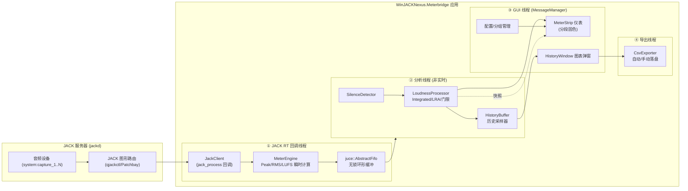

# WinJACKNexus.Meterbridge 项目计划书

## 文档信息

| 项目 | 内容 |
|---|---|
| 项目名称 | WinJACKNexus.Meterbridge（基于 JUCE + JACK 的自定义通道电平表桥） |
| 目标平台 | Windows 10/11（x64） |
| 框架/依赖 | JUCE 9.0.0（`third_party/JUCE`）、JACK2 Windows 发行版（`third_party/JACK2`） |
| 构建系统 | CMake ≥ 3.22 + MSVC + Ninja |
| 文档版本 | v1.0 |
| 创建日期 | 2026-08-09 |

---

## 一、项目概述

### 1.1 背景
在 Windows 平台上，需要一款能够接入 JACK 音频服务器、对多路输入通道进行实时电平监测、响度测量与历史曲线分析的工具。通过 JACK 的任意路由能力（qjackctl / Patchbay），可灵活将任意声源接入本桥进行测量。

### 1.2 目标
- 以 JACK 为音频后端，实时采集 N 路输入通道信号。
- 为每路通道提供独立、精确到通道级的电平表（Peak / RMS / dBTP / Momentary LUFS / Short-term LUFS / Integrated LUFS / LRA，共 7 个，均显示于主界面卡片）。
- 支持通道与分组管理、配置持久化（`.meter` JSON 存档）。
- 支持每通道历史曲线分析弹窗（扫描/滚动模式、多指标、CSV 导出）。
- 支持响度重置逻辑（手动 / 静音自动触发 / 每通道独立自动记录联动）。
- 内置响度/峰值标准预设库并支持自定义预设；电平表分段与历史曲线参考线随所选预设动态调整。

### 1.3 范围界定
- **包含**：输入（capture）通道的采集、测量、展示、分析、导出；Windows x64 桌面应用。
- **排除**：输出/发送通道；音频录制与回放；VST/插件化形态；跨平台（Linux/macOS 仅作为后续扩展方向）；无损监听功能。

---

## 二、技术选型与依赖

| 组件 | 选择 | 说明 |
|---|---|---|
| GUI 框架 | JUCE 9.0.0 | `third_party/JUCE`，以 CMake 集成（`add_subdirectory`） |
| 音频后端 | JACK2 C API | `third_party/JACK2`，链接 `lib/libjack64.lib`，部署 `libjack64.dll` |
| 模块 | `juce_core` `juce_events` `juce_graphics` `juce_gui_basics` `juce_audio_basics` `juce_audio_devices` `juce_audio_processors` `juce_dsp` `juce_data_structures` `juce_opengl` | `AbstractFifo`（juce_core）、OpenGL（juce_opengl）、K 加权滤波参考（juce_dsp） |
| 构建 | CMake ≥ 3.22 + MSVC + Ninja | 贴合既有工具链；`libjack64.dll` 通过 CMake 拷贝到输出目录 |

> **关键架构依据**：JUCE 9 的 `juce_audio_devices` 原生支持 Windows JACK（`juce_JackAudio.cpp` 用 `LoadLibraryA("libjack64.dll")` + `GetProcAddress` 动态加载）。但本项目按需求采用**直接 JACK Client**：自定义 `JackClient` 封装直链 `libjack64.lib`，在 JACK 实时回调中采集端口缓冲，经 `juce::AbstractFifo` 无锁传递，以获取对端口/连接的完全控制。

---

## 三、总体架构设计

### 3.1 系统架构图



### 3.2 模块划分

| 模块 | 职责 |
|---|---|
| `JackClient` | JACK 客户端生命周期、端口注册/注销、进程回调入口、采样率/缓冲变更回调 |
| `MeterEngine` | 每通道瞬时 Peak / RMS（dBFS）与 K 加权后的 Momentary / Short-term LUFS 计算 |
| `LoudnessProcessor` | BS.1770-4 门限逻辑、Integrated LUFS、LRA（短时响度分位） |
| `SilenceDetector` | 静音阈值 + 持续时长检测，触发自动重置 |
| `HistoryBuffer` | 每通道多指标历史环形采样（时间窗 30s~3600s 可调） |
| `HistoryWindow` | 右键弹窗：扫描/滚动渲染、曲线显隐、时间缩放、CSV 导出 |
| `MeterStrip` / `MeterComponent` | 分段固色柱状表 + 通道列布局 |
| `ChannelModel` / `MeterConfig` | 通道/分组状态、`.meter` JSON 编解码、UI 状态恢复 |
| `CsvExporter` | 后台线程 CSV 写入、每通道 Record 开关触发的自动落盘 |

### 3.3 线程模型
1. **JACK RT 回调线程**（实时）：无分配、无锁；仅把每 block 的瞬时指标写入 `AbstractFifo`。
2. **分析线程**（非实时，`juce::Thread`）：消费 FIFO → 更新 Integrated/LRA、静音检测、历史缓冲；经原子快照供 GUI 读取。
3. **GUI 线程**（MessageManager）：`Timer` 以 30~60 fps 读取快照重绘仪表；处理重置/配置/图表交互。
4. **CSV 导出**：手动导出在后台线程执行；自动记录（reset 触发）也走后台线程，避免阻塞 GUI。

### 3.4 数据流
每通道每 block 产出统一指标帧：

```
struct MeterBlock {
    float  peakDB, rmsDB, truePeakDBTP;  // 瞬时（dBFS / dBTP）
    float  momentaryLUFS, shortTermLUFS;
    double integratedLUFS;             // 累计，直到重置
    float  lraLU;
    int64  timestampMs;                // 采样时刻
};
```

- FIFO → 分析线程 → 快照（最新一帧）与历史缓冲（按采样间隔追加）。
- 图表弹窗按所选时间窗读取历史缓冲重绘；导出时附标准时间戳。

---

## 四、核心设计规范

### 4.1 分段固色配色规范（Strict Color Code）
所有电平表为**分段固色（Solid Block）**，禁止渐变过渡；**表柱每个角均为直角（禁止圆角/斜角）**。
主界面每张卡片共显示 **7 个电平表**：Peak 表、RMS 表、dBTP 表（dBFS / dBTP 量程，复用 A 配色）、Momentary LUFS 表、Short-term LUFS 表、Integrated LUFS 表（LUFS 量程，复用 B 配色）、LRA 表（复用 C 配色）。

**A. 峰值表（Peak Meter）** — 量程 `-60 ~ +12 dBFS`（RMS 表同量程同配色）

| 区间 | 含义 | 颜色 |
|---|---|---|
| -60 ~ -12 dBFS | 安全区 | `#2ECC71`（绿） |
| -12 ~ 0 dBFS | 预警区 | `#F1C40F`（黄） |
| 0 ~ +12 dBFS | 过载区 | `#E74C3C`（红） |

**A1. 真峰值表（dBTP Meter）** — 量程 `-60 ~ +12 dBTP`，复用 A 配色（绿/黄/红三段）。

**B. 响度表（LUFS Meter）** — 量程 `-60 ~ 0 LUFS`（Momentary / Short-term / Integrated 三表同量程同配色）

| 区间 | 含义 | 颜色 |
|---|---|---|
| -60 ~ -23 LUFS | 低响度区 | `#34495E`（深青/蓝灰） |
| -23 ~ -14 LUFS | 标准目标区 | `#1ABC9C`（冰蓝） |
| -14 ~ 0 LUFS | 高响度区 | `#E67E22`（橙） |

**C. LRA（响度范围表）** — 量程 `0 ~ 50 LU`，单色紫罗兰 `#9B59B6`。

**预设联动（动态分段）**：**每个通道可按自身所选预设**调整本卡片 LUFS 表的标准目标区与 dBTP 表的过载区边界（详见 4.7）；不使用预设时保持上述固定分段。

> 注：dB/LUFS 以对数刻度线性映射到像素高度（即刻度分度按 dB 线性而非幅度线性）。

### 4.2 通道与分组管理
- **通道操作**：界面手动增/删通道；双击重命名。
- **通道数上限（可调项）**：通道数上限可通过配置调整，**默认 32，最大硬上限 4096**（`.meter` 中 `channelLimit` 控制，取值 1~4096）；达到上限时增通道操作被禁止并提示。
- **动态分组**：创建/修改分组名；将通道分配至分组（一通道可属一个分组）。
- 增删通道实时同步 JACK 端口（`jack_port_register` / `jack_port_unregister`，控制线程调用）。
- **仅支持输入通道**：每通道对应一个 `JackPortIsInput` 端口；端口连线完全由 qjackctl / Patchbay 管理，应用不自动创建、保存或恢复 JACK 连线。
- **JACK 端口命名规范（将通道名暴露至 Patchbay）**：
  - 本桥输入端口**短名 = 通道名**，完整端口名 = `JackMeterBridge:<通道名>`（Patchbay / qjackctl 中即显示为通道名）。
  - **默认通道名**：`In1`、`In2`、… `InN`（增删通道时保持连续编号、不重复）。
  - **通道重命名同步端口**：重命名通道（如改为 `L`）时调用 `jack_port_rename` 同步端口短名；该 API 由控制线程调用，且连接绑定端口对象，重命名后已有布线保留。
  - **端口名合法性清洗**：JACK 端口名不允许空格、`:`、`/` 等字符（`:` 为 `client:port` 分隔符）；非法字符替换为 `_`，若清洗后与其他端口重名则追加序号（如 `L`、`L_2`）。
  - **UI 名与端口名解耦**：界面可显示含空格的原始名称，端口名始终使用清洗后版本；完整名超过 `jack_port_name_size()` 时截断。

### 4.3 配置持久化（`.meter` 存档）
- 后缀 `.meter`，内部为标准 JSON；`juce::JSON` / `juce::DynamicObject` 编解码。
- 字段：格式标识、版本、通道数量、通道名称、分组归属、历史窗口时间、重置阈值参数、**每通道自动记录开关（`record`，默认关闭）**、**通道数上限（`channelLimit`，默认 32，最大 4096）**、**每通道响度预设（通道字段 `presetId`，默认 `ebu_r128`）与全局自定义预设列表（`customPresets`）**。
- 启动自动恢复 UI 状态；提供"保存/另存为/加载"入口。
- 工程预设使用 `.meter` JSON 文件，保存到应用程序同级 `meter_saves/`；主界面提供工程预设保存和列表加载，加载后恢复通道、分组、参数、记录状态与每通道响度预设。

```json
{
  "format": "WinJACKNexus.MeterBridge",
  "version": 1,
  "historyWindowSeconds": 600,
  "silenceResetThresholdDB": -60.0,
  "silenceResetDurationSeconds": 5.0,
  "channelLimit": 32,
  "customPresets": [],
  "groups": [ { "id": "g1", "name": "Drums", "channelIds": ["ch1", "ch2"] } ],
  "channels": [
    { "id": "ch1", "name": "L",   "groupId": "g1", "record": false, "presetId": "ebu_r128" },
    { "id": "ch2", "name": "R",   "groupId": "g1", "record": false, "presetId": "spotify_normal" }
  ]
}
```

### 4.4 历史曲线与图表弹窗
- **触发**：右键任意通道仪表 → 弹出该通道专属分析窗口（`juce::DialogWindow`）。
- **刷新模式**：
  - **扫描模式（Scan）**：扫描线从左向右绘制，到右端后清屏重头开始（类心电图）。
  - **滚动模式（Scroll）**：新数据在右侧产生，整体向左平滑滚动。
- **时间窗口**：30s ~ 3600s（1h）自由调节；历史缓冲环形覆盖，超窗数据自动淘汰。
- **曲线控制与图例**：Peak、RMS、dBTP、Momentary LUFS、Short-term LUFS、Integrated LUFS、LRA 多曲线，各自独立显隐开关；**每条曲线使用各自独立且互不相同的颜色**，并配有**图例（Legend）**（曲线名 + 颜色色块）以区分。

  | 曲线 | 图例颜色 |
  |---|---|
  | Peak | `#E74C3C`（红） |
  | dBTP | `#E91E63`（品红） |
  | RMS | `#F1C40F`（黄） |
  | Momentary LUFS | `#3498DB`（蓝） |
  | Short-term LUFS | `#1ABC9C`（青） |
  | Integrated LUFS | `#9B59B6`（紫） |
  | LRA | `#E67E22`（橙） |
- **警戒参考线**：按**该通道所选预设**绘制**两条不同颜色的水平虚线参考线**——目标响度线（`#F39C12` 琥珀色）与真峰值上限线（`#C0392B` 深红色），位置随该通道预设取值（见 4.7）。
- **CSV 导出**：横轴为标准时间戳 `YYYY-MM-DD HH:MM:SS`，纵轴为各指标数值（格式见附录 A）。

### 4.5 响度重置逻辑
- **手动重置（单通道）**：每个通道卡片上的**独立 Reset 按钮**（每通道各一个，互不影响）→ 仅清除**该通道**的 Integrated LUFS 及历史统计。
- **手动重置（全局）**：主界面另设一个**全局 Reset 按钮** → 一键清除**所有通道**的 Integrated LUFS 及历史统计。
- **自动重置（静音触发）**：配置"静音阈值"（默认 -60 dB）与"持续时长"（默认 5s）；信号持续低于阈值达时长 → 自动重置。
- **自动记录联动（每通道独立开关）**：每个通道卡片上设有独立的 **Record 开关**（默认关闭）；仅当开关开启时，应用才会按照全局保存间隔追加该通道的当前计量快照。
- **日志目录与文件格式**：Settings 提供日志根目录和保存间隔（默认 `logs`、1 s）。每个通道在日志根目录下拥有独立文件夹：`<日志根目录>/<通道名>/`；每个记录段写入新的 `YYYY-MM-DD_HH-mm-ss-SSS.csv`。每次单通道、全局或静音自动 Reset 都会结束当前文件，并在下一次记录时创建新文件；毫秒字段保证同一秒内重置也不会复用文件名。通道名中的 Windows 非法文件名字符替换为 `_`。每个 CSV 首次写入会创建表头，后续追加时间戳及 Peak、RMS、dBTP、Momentary、Short-term、Integrated、LRA 的数值。

### 4.6 仪表盘 UI 布局规范
- **卡片式布局**：每个通道为一张**独立卡片（Card）**，卡片宽度**固定**，多卡片在水平方向依次排列。
- **高度自适应**：卡片高度（含表头与数值区）**自动适配当前窗口高度**，随窗口缩放实时变化。
- **横向滚动**：当所有卡片总宽度超过当前窗口/屏幕宽度时，主区域显示**横向滚动条**，可滚动/翻页查看，卡片宽度不被压缩。
- **每张卡片自上而下的布局**：
  - **通道名**（卡片标题，位于最上方）。
  - **预设选择器**：每通道独立，选择该通道使用的响度/峰值预设（见 4.7）。
  - 每个电平表（共 7 个：Peak / RMS / dBTP / Momentary LUFS / Short-term LUFS / Integrated LUFS / LRA）区域：**表名在表上方**（如 `PEAK` / `RMS` / `DBTP` / `MOMENTARY` / `SHORT-TERM` / `INTEGRATED` / `LRA`），**无单位数值在表下方**（如 `-23.4`、`-14.2`、`8.3`，不显示 dBFS / LU / LUFS 等单位）。
  - **表名缩写与悬浮提示**：表名过长时可显示缩写——Momentary → `M`、Short-term → `S`、Integrated → `I`；鼠标悬浮（hover）时以提示框（Tooltip）显示完整表名（如 `Momentary LUFS`）。
  - **按钮区（统一位于卡片底部）**：
    - **独立 Reset 按钮**：每个通道卡片各有一个，仅作用于该通道。
    - **独立 Record 开关**：每个通道卡片各有一个（默认关闭），仅开启时该通道才自动记录到 CSV（见 4.5）。
- **全局 Reset 按钮**：主界面顶部/工具条另设一个全局 Reset 按钮，一键重置所有通道（见 4.5）。

### 4.7 响度/峰值预设库（Loudness Preset Library）
- **内置标准预设**：内置常见平台/行业响度与真峰值标准（见附录 D），如 Spotify（-14 LUFS / -1 dBTP）、EBU R128（-23 LUFS / -1 dBTP）、Netflix（-27 LUFS / -2 dBTP）等；每项含 目标响度（Integrated LUFS）、真峰值上限（True Peak Max, dBTP）、建议容差（LU）。
- **自定义预设**：允许用户创建/修改/删除自定义预设（名称 + 目标响度 + 真峰值上限 + 容差），与内置预设一同在预设选择器中供选择。
- **预设选择（每通道独立）**：每个通道卡片提供**独立预设选择器**（新通道默认 `ebu_r128`，也可选择"不使用预设"以恢复固定分段）；预设定义（内置 + 自定义）全局共享。
- **颜色分段随预设动态调整（按通道）**：各通道按自身所选预设调整本卡片分段：
  - **LUFS 表**：标准目标区 = `[目标响度 − 容差, 目标响度 + 容差]`，低/高响度区随之上下移动，配色不变（深青/冰蓝/橙）。
  - **dBTP 表**：过载区（红）起点 = 真峰值上限（`[true_peak_max, +12]`）；预警区（黄）= `[-12, true_peak_max]`；安全区（绿）= `[-60, -12]`。
  - 不使用预设（默认固定分段）：LUFS 标准目标区固定 `-23 ~ -14`，dBTP 过载区从 `0 dBTP` 起。
- **历史曲线警戒参考线**：图表绘制**两条不同颜色的水平虚线**，取值随该通道所选预设：
  - 目标响度参考线（如 -14 LUFS）：`#F39C12`（琥珀色）。
  - 真峰值上限参考线（如 -1 dBTP）：`#C0392B`（深红色）。
- **持久化**：每通道所选预设存入 `.meter`（通道字段 `presetId`）；自定义预设列表全局存储（`customPresets`）。

---

## 五、阶段一：原型设计与前端 UI/UX（Prototype & UI Design Phase）

> 本阶段直接使用真实 JACK 音频数据开发与验收；里程碑 1.2 的仪表组件与 2.2 引擎通过数据快照接口对接。

### 阶段一完成记录（2026-08-09）

阶段一视为完成。当前版本已经具备可运行的前端原型、配置持久化和历史分析界面，并完成 Debug 构建与启动检查。

| 里程碑 | 完成情况 | 实际交付 |
|---|---|---|
| 1.1 主窗口卡片式布局与 8 通道默认 UI | 已完成 | 8 个默认通道卡片、固定卡片宽度、高度自适应、横向滚动、通道名称编辑、Reset / Record 控件。 |
| 1.2 分段固色柱状图 Component | 已完成 | Peak、RMS、dBTP、Momentary、Short-term、Integrated、LRA 七个仪表；分段颜色、预设联动、窄窗口下 M / S / I 缩写和 Tooltip。 |
| 1.3 通道/分组管理 UI | 已完成 | 通道增删、通道重命名、分组创建与重命名、通道分组选择、卡片拖动排序、卡片与分组颜色。通道上限可配置为 1~4096，默认 32。 |
| 1.4 历史图表弹窗 | 已完成 | 扫描 / 滚动模式、多指标显隐、图例、预设参考线、时间窗口滑块、CSV 导出、历史数据悬浮查看。 |
| 1.5 `.meter` 编解码与状态恢复 | 已完成 | `.meter` JSON 保存 / 加载、启动自动恢复、通道 / 分组 / 颜色 / 预设 / Record 状态持久化；应用同级 `config.json` 全局设置；自定义 `.loudness` 预设和 `loudness_saves` 刷新；工程预设和 `meter_saves` 列表加载。 |

#### 阶段一的实现取舍

1. **组件与真实音频链路同步实现**：仪表组件直接消费真实 JACK 数据快照，JACK Client、无锁 FIFO、Peak / RMS / dBTP / LUFS / LRA 算法统一按实时线程边界实现。
2. **配置职责分层**：通道、分组和界面状态写入 `.meter`；全局默认值写入应用程序同级 `config.json`；自定义响度标准单独保存为 `loudness_saves/*.loudness`，工程预设保存为 `meter_saves/*.meter`，两个目录分别刷新和管理。
3. **模块化采用渐进拆分**：已将历史公共类型、响度预设库、设置编辑器分别整理到 `src/history`、`src/presets`、`src/settings`；历史图表、通道卡片、仪表和分组之间存在较强的内部依赖，暂时保留在 `MainComponent.cpp`，避免为追求文件数量而引入不必要的接口层和行为回归。
4. **设置窗口优先保证布局稳定**：数值设置使用 Slider，预设使用 ComboBox；设置内容由统一组件管理，避免 `AlertWindow` 逐项排版造成控件截断或按钮重叠。
5. **当前验收以构建与启动稳定为主**：已完成 MSVC + Ninja Debug 编译、诊断检查和启动检查；真实 JACK 路由、标准测试信号精度、实时线程性能和长时间稳定性测试纳入阶段二。

#### 阶段一实际模块结构

```text
src/
├─ Main.cpp
├─ MainComponent.cpp
├─ MainComponent.h
├─ history/
│  └─ HistoryTypes.h
├─ loudness_saves/
├─ meter_saves/
│  └─ LoudnessPresetLibrary.h
└─ settings/
  └─ SettingsEditors.h
```

### 里程碑 1.1 — 主窗口卡片式布局与 8 通道默认 UI
- **内容**：基于 JUCE `Component`/`ResizableWindow` 的主窗口；**卡片式布局**（见 4.6）：每通道为独立卡片、宽度固定、高度自适应窗口高度，卡片总宽超出窗口时显示横向滚动条；默认初始化 8 个输入通道，每卡片含 通道名、**7 个电平表**（Peak / RMS / dBTP / Momentary LUFS / Short-term LUFS / Integrated LUFS / LRA，各表名在上、无单位数值在下）、底部按钮区（独立 Reset 按钮与独立 Record 开关，统一位于卡片底部）；主界面顶部另设**全局 Reset 按钮**（一键重置所有通道）。
- **验收**：窗口高度变化时卡片/表头高度自适应；卡片宽度固定不压缩，超宽时横向滚动条可滚动查看；8 通道默认铺开；无音频时 UI 正常。
- **交付物**：`MainComponent`、`MeterStrip` 骨架、卡片布局与横向滚动代码。

### 里程碑 1.2 — 分段固色柱状图 Component
- **内容**：自绘 `Component`（`paint()`）实现分段固色表头；实现 4.1 节三套配色映射（dBFS / LUFS / 紫罗兰），复用于 7 个电平表（Peak/RMS/dBTP 同 dBFS/dBTP、Momentary/Short-term/Integrated 同 LUFS、LRA 单色）；**分段边界支持按当前通道所选预设动态计算**（LUFS 标准目标区与 dBTP 过载区边界随该通道预设移动，见 4.7）；**表柱每个角均为直角（禁止圆角）**；支持 dB→像素对数映射；动态刷新优化（仅重绘脏区/数值变化帧，30~60fps 节流；可叠加 OpenGL）。
- **验收**：7 个电平表颜色分段严格符合规范；**切换某通道预设后，该卡片 LUFS 标准目标区与 dBTP 过载区边界即时更新**；**表柱均为直角无圆角**；数值驱动刷新平滑；无闪烁。
- **交付物**：`MeterComponent`（可复用 Peak/LUFS/LRA 三种模式）、配色常量表。

### 里程碑 1.3 — 通道/分组管理 UI
- **内容**：增删通道、双击重命名、分组创建/改名、通道分配分组；右键菜单与上下文交互；分组聚合视图（可选折叠）。
- **验收**：增删/重命名即时生效；分组状态正确；端口同步逻辑预留接口。
- **交付物**：`ChannelModel` 状态类、管理菜单/对话框、与 `JackClient` 的端口同步接口。

### 里程碑 1.4 — 历史图表弹窗
- **内容**：右键弹窗；自绘图表引擎；**扫描/滚动**两种渲染算法；多曲线显隐开关；**每条曲线独立颜色与图例**（见 4.4 配色表）；**两条不同颜色的警戒参考线**（目标响度线 `#F39C12`、真峰值上限线 `#C0392B`，取值随该通道预设）；时间窗（30s~3600s）缩放控件；CSV 导出按钮与文件对话框。
- **验收**：两种模式渲染正确；时间窗调节即时生效；曲线显隐生效；**各曲线颜色互不相同且有图例标注**；**两条参考线颜色不同、位置随该通道预设取值正确**；CSV 按附录 A 格式导出。
- **交付物**：`HistoryWindow`、`ChartRenderer`、`CsvExporter` 界面部分。

### 里程碑 1.5 — JSON 规范（.meter）编解码与状态恢复
- **内容**：`.meter` JSON 读写（见 4.3）；启动加载恢复通道/分组/窗口/阈值/每通道所选响度预设与自定义预设；文件对话框、校验与容错。
- **验收**：保存→重启→加载状态完全恢复；损坏文件友好报错。
- **交付物**：`MeterConfig` 编解码器、`.meter` 示例文件、UI 状态恢复逻辑。

---

## 六、阶段二：底层音频引擎与逻辑设计（Audio Engine & Core Logic Phase）

### 里程碑 2.1 — JACK Client 与无锁环形缓冲
- **内容**：`JackClient` 封装（直链 `libjack64.lib`）：`jack_client_open`（`JackNoStartServer`）→ 按通道名注册输入端口（默认 `In1/In2…`，端口短名 = 通道名，见 4.2 命名规范）→ `jack_set_process_callback` → `jack_activate`；JACK 连线完全由 qjackctl/Patchbay 管理；**通道重命名时调用 `jack_port_rename` 同步端口短名（清洗非法字符，保留已有连接）**；RT 回调内零分配零锁，写 `juce::AbstractFifo`；处理采样率/缓冲变更与断线恢复；DLL 缺失/服务器未启动的友好提示。
- **验收**：qjackctl 可见客户端与 N 路输入端口；连接后数据流正常；断开/重连不崩溃。
- **交付物**：`JackClient`、`AbstractFifo` 队列、JACK 连接/生命周期管理。

### 里程碑 2.2 — Peak/RMS 与 LUFS/LRA 计算引擎（已完成，2026-08-09）
- **内容**：`MeterEngine` 瞬时 Peak / RMS（dBFS，RMS 按 10ms 窗口）与 **dBTP 真峰值**（True Peak，按 ITU-R BS.1770 建议 4 倍过采样计算）；`LoudnessProcessor` 按 **ITU-R BS.1770-4 + EBU R128**：K 加权（预滤波 biquad + 高通）、-70 LUFS 绝对门、-10 LU 相对门、400ms 块、Integrated LUFS、LRA（短时响度 95%−5% 分位）；每通道独立（单声道加权 1.0）；**预设引擎**：按**每通道所选预设**输出 目标响度 / 真峰值上限 / 容差，供仪表分段与历史曲线参考线使用（见 4.7）。
- **验收**：通过真实 JACK 输入的外部标准测试信号（如 -20 dBFS 1kHz 正弦、ITU 参考音）验证数值误差在容差内；LRA 计算正确；某通道预设切换后该通道分段边界与参考线取值正确。
- **交付物**：`MeterEngine`、`LoudnessProcessor`（含 K 加权系数表）、算法单元测试。

> 完成记录：新增每通道 `MeterEngine`，从 JACK 无锁 FIFO 消费真实音频块，实时向卡片与历史视图提供 Peak、10ms RMS、4 倍过采样 dBTP、K 加权 Momentary/Short-term、Integrated LUFS 和 LRA。已通过外部标准信号、静音输入和双电平真实输入场景验证。

> 状态显示记录（2026-08-09）：主窗口工具栏新增 LCD 状态区，显示 JACK 采样率、缓冲帧数与 FIFO 丢块状态。状态区仅由 `MainComponent` 的 GUI 定时器以 4 Hz 轮询 `JackClient::getStatus()` 的原子快照后重绘；不向 JACK 实时回调增加计时、回调或跨线程 UI 访问。Debug 构建通过，并已通过 Windows `WM_CLOSE` 验证正常关闭。

### 里程碑 2.3 — 静音检测与响度重置逻辑（已完成，2026-08-09）
- **内容**：`SilenceDetector`（阈值 + 持续时长，可配置）；手动 Reset；自动重置联动；重置后 Integrated/LRA/历史清零；触发时向 GUI 发事件。
- **验收**：低于阈值持续设定时长自动重置；手动重置即时生效；阈值/时长配置生效。
- **交付物**：`SilenceDetector`、重置状态机、事件分发。

> 完成记录：新增每通道 `SilenceDetector`，以每个音频块的 Peak dBFS 与帧数精确累计连续静音时长；信号高于阈值时重新计时，连续静音只触发一次，信号恢复后重新武装。Settings 中既有的静音阈值与持续时间现在会立即应用至所有通道。单通道 Reset、全局 Reset 与自动 Reset 共用测量引擎/历史/dBTP 锁存/Peak 保持条的清理路径；静音检测在 GUI 消费 FIFO 时执行，不增加 JACK 实时回调负担。`SilenceDetectorTests` 覆盖触发时长、单次触发和信号恢复后的重新计时。

### 里程碑 2.4 — 通道 CSV 自动记录（已完成，2026-08-09）
- **内容**：复用每通道历史采样与 `Record` 开关，在 GUI 消费 FIFO 的现有计时器中按保存间隔写入计量快照；Settings 新增日志根目录与保存间隔。每个通道独立写入 `<日志根目录>/<通道名>/YYYY-MM-DD_HH-mm-ss-SSS.csv`，首次写入自动创建目录和 CSV 表头；每次 Reset 强制切换至新文件。
- **验收**：开启 Record 的通道按配置间隔追加包含 ISO 8601 时间戳与七项计量值的 CSV 行；关闭 Record 的通道不创建或写入日志；不同通道不共享日志文件夹；每次单通道、全局或静音自动 Reset 后均创建新的日期时间命名 CSV。
- **交付物**：通道目录日志、`config.json` 日志设置、自动记录调度。

> 完成记录：`logRootDirectory` 与 `logSaveIntervalSeconds` 已持久化至 `config.json`，旧版配置自动回退至可执行文件旁的 `logs` 目录与 1 s 间隔。每个通道维护当前记录段文件，Reset 会清空该状态以强制下一条记录创建新的日期时间 CSV。日志只在 GUI 线程完成 FIFO 音频块消费后追加，不在 JACK 实时回调中执行文件 I/O；通道新增、删除、重排和加载配置时均会同步日志节流状态。Debug 构建通过，`MeterEngineTests` 与 `SilenceDetectorTests` 均通过。

### 里程碑 2.5 — 系统集成、性能优化（已完成，2026-08-09）
- **内容**：两阶段集成联调；**OpenGL 渲染**开启与软件渲染回退；内存/CPU 控制（FIFO 容量、历史缓冲上限、刷新节流、RT 线程无分配验证）；长时间稳定性测试。
- **验收**：默认 32 通道、可扩展至上限 4096 长时间运行稳定；CPU 占用合理；OpenGL 可用时启用、不可用时自动回退。
- **交付物**：集成版本、性能报告、稳定性测试记录。

> 完成记录（2026-08-09）：已移除 GUI 消费端“每帧最多 4 个音频块”的人为限制，单通道每次刷新最多消费完整的 `JackClient::blockQueueDepth`（当前为 32）个 FIFO 块。每个端口 FIFO 深度也从 8 扩展到 32：在 48 kHz / 64 帧配置下可缓冲约 43 ms 的 GUI 抖动，仍在端口创建时一次性预分配，JACK 实时回调不引入动态分配或锁。仪表仍只对最终最新测量快照重绘，避免将队列追赶过程放大为额外重绘；这降低了常见小缓冲配置下的 FIFO 积压与 `DROP` 风险。自动 CSV 记录使用单一后台写入线程，GUI 线程只将快照提交到有界队列（1024 条）；队列满时丢弃新日志请求而不阻塞测量、重绘或 JACK 音频处理。CSV 单次追加会同时写入新文件表头与首行，避免表头与数据之间产生失败窗口；写入错误和队列丢弃数显示在 LCD 状态区。已接入 `juce_opengl` 并将可选 OpenGL 上下文附着至主界面，高频仪表绘制可使用硬件加速；上下文不可用时自动保留既有软件 `paint()` 路径，状态区显示 `GL` 或 `SW`。Debug 构建、`MeterEngineTests` 与 `SilenceDetectorTests` 已通过；真实 JACK 路由下的长时间运行验收由手动会话确认。

---

## 七、项目目录结构（规划）

```
WinJACKNexus.Meterbridge/
├── CMakeLists.txt                 # 主工程：集成 third_party/JUCE + JACK
├── cmake/
│   └── CopyJackDll.cmake          # 拷贝 libjack64.dll 到输出目录
├── src/
│   ├── Main.cpp / MainComponent.h/.cpp
│   ├── audio/JackClient.h/.cpp    # 里程碑 2.1
│   ├── audio/MeterEngine.h/.cpp   # 里程碑 2.2
│   ├── audio/LoudnessProcessor.h/.cpp
│   ├── audio/SilenceDetector.h/.cpp  # 里程碑 2.3
│   ├── core/ChannelModel.h/.cpp   # 里程碑 1.3
│   ├── core/MeterConfig.h/.cpp    # 里程碑 1.5
│   ├── core/HistoryBuffer.h/.cpp  # 里程碑 2.4
│   ├── ui/MeterComponent.h/.cpp   # 里程碑 1.2
│   ├── ui/MeterStrip.h/.cpp       # 里程碑 1.1
│   ├── ui/HistoryWindow.h/.cpp    # 里程碑 1.4
│   └── io/CsvExporter.h/.cpp      # 里程碑 2.4
└── tests/                         # 算法单元测试（可选）
```

---

## 八、测试与验收计划

1. **单元测试**：颜色分段映射、dB→像素映射、`.meter` 编解码、LUFS/LRA 数值（标准参考信号）。
2. **集成测试**：JACK 连接/断线、通道增删的端口同步、重置逻辑、自动记录 CSV。
3. **手动验证**：qjackctl 布线后观察各表数值；右键图表两种模式；缩放与导出。
4. **性能/稳定性**：多通道长时间运行，监控 CPU/内存；OpenGL 启停对比。

---

## 九、风险与对策

| 风险 | 对策 |
|---|---|
| JACK 服务器未运行 / DLL 缺失 | 启动检测 + 友好提示；`JackNoStartServer` 策略 |
| RT 线程性能（分配/锁） | 回调内零分配；`AbstractFifo` 单写单读；预分配缓冲 |
| 长时间运行内存增长 | 环形缓冲固定上限；历史窗口淘汰策略 |
| Windows JACK2 下偶发 `0xc0000374` 堆损坏 | 当前 LCD 已与实时回调和退出生命周期隔离，关闭验证通过；仍需使用原生调试器在首次堆损坏处捕获调用栈，定位 JACK 客户端/回调生命周期中的根因。 |
| OpenGL 兼容性 | 运行时探测，失败回退软件渲染 |
| 大时间窗（1h）图表渲染卡顿 | 降采样绘制 + 脏区重绘 + 曲线显隐 |

---

## 十、里程碑进度与依赖

| 里程碑 | 依赖 | 可并行 |
|---|---|---|
| 1.1 主窗口/8 通道 | — | 与 2.1 并行 |
| 1.2 分段固色表 | 1.1 | 与 2.2 并行 |
| 1.3 通道/分组管理 | 1.1 | 与 2.3 并行 |
| 1.4 历史图表弹窗 | 1.1 | 与 2.4 并行 |
| 1.5 .meter 编解码 | 1.3 | 与 2.4 并行 |
| 2.1 JACK Client/FIFO | — | 与 1.1 并行 |
| 2.2 Peak/RMS/dBTP/LUFS/LRA | 2.1 | — |
| 2.3 静音检测/重置 | 2.2 | — |
| 2.4 历史采样/CSV | 2.2、2.3 | 含 1.4/1.5 联调 |
| 2.5 集成与性能优化 | 全部 | — |

---

## 十一、交付物清单（Deliverables）

- 阶段一：主窗口与 8 通道 UI、分段固色表组件、通道/分组管理、历史图表弹窗、`.meter` 编解码与状态恢复。
- 阶段二：JACK Client 与无锁队列、Peak/RMS/dBTP/LUFS/LRA 引擎、静音检测与重置、历史采样与 CSV 导出、集成与性能优化版本。
- 文档：本计划书、配色规范、`.meter`/CSV 格式说明、使用说明。

## 十二、WinJACKNexus 合并实施阶段

### M4：建立 MeterBridge 独立 APP

1. 新增 `modules/WinJACKNexus.MeterBridge` 和顶层 `add_subdirectory`。
2. 迁移 Meter Bridge 的应用入口、主窗口、设置编辑器、历史曲线、分组/通道界面和资源。
3. 将应用层对 `JackClient`、`MeterEngine`、`SilenceDetector`、历史和 CSV 的直接实现改为 Common API 调用。
4. 将产品标识、target、窗口标题和测试名称统一为 `MeterBridge` / `WinJACKNexus.MeterBridge`。
5. 保证 MeterBridge 可以单独启动、单独连接 JACK，并在无 JACK 服务时显示明确的连接失败状态。

**验收**：MeterBridge 不依赖 Mixer 或 Adapter 即可运行；真实 JACK 输入能驱动通道计量、历史记录和 CSV 导出；Common 中不存在 MeterBridge 的窗口或应用状态。

## 十三、WinJACKNexus 模块落地边界

### M4.1 目标目录与应用迁移

MeterBridge 的应用层目标目录为：

```text
modules/WinJACKNexus.MeterBridge/
  CMakeLists.txt
  Resources/
  Source/
    Main.cpp
    App/
      MeterBridgeApplication.h/.cpp
      MeterBridgeMainWindow.h/.cpp
    Model/
      MeterProject.h/.cpp
      MeterChannelModel.h/.cpp
    UI/
      MeterBridgeMainComponent.h/.cpp
      MeterChannelCard.h/.cpp
      HistoryWindow.h/.cpp
      SettingsDialog.h/.cpp
```

迁移 `ref/WinJACKNexus.Meterbridge` 时，`Main.cpp`、`MainComponent.*`、设置编辑器、历史窗口/曲线、分组/通道管理、响度预设选择、CSV 工作流、图标和资源属于 MeterBridge。`JackClient`、`MeterEngine`、`SilenceDetector`、`MeterFrame`、历史数据类型和 CSV 底层能力只通过 Common 使用，不在 MeterBridge 重复实现。

### M4.2 应用级测试与独立运行

- MeterBridge 单测覆盖 `MeterFrame` 展示适配、通道/分组模型、静音重置、历史窗口数据、CSV 配置和 `.meter` 存档。
- UI 验收覆盖正常电平、无信号、静音、Peak hold、历史曲线、CSV 导出、窄窗口和 `Common + MeterBridge` 主题覆盖。
- MeterBridge 必须能够单独启动、连接 JACK 和关闭，不要求 Mixer 或 Adapter 同时运行。
- 与 Adapter、Mixer 并行运行时，JACK client/port 命名、线程生命周期和资源释放必须符合 Common 的跨 APP 约定。

---

## 附录

### A. CSV 导出格式样例
```csv
timestamp,peak_dbfs,rms_dbfs,true_peak_dbtp,momentary_lufs,short_term_lufs,integrated_lufs,lra_lu
2026-08-09T10:00:00.000Z,-23.400,-30.100,-23.100,-22.500,-21.900,-20.100,8.300
2026-08-09T10:00:01.000Z,-20.200,-27.800,-19.900,-21.400,-21.500,-20.200,8.200
```

### B. .meter 样例
见 4.3 节 JSON 示例。

### C. 配色速查表

| 表 | 区间 | 颜色 |
|---|---|---|
| Peak | -60~-12 / -12~0 / 0~+12 dBFS | `#2ECC71` / `#F1C40F` / `#E74C3C` |
| dBTP | -60~-12 / -12~0 / 0~+12 dBTP | `#2ECC71` / `#F1C40F` / `#E74C3C`（复用 Peak） |
| LUFS | -60~-23 / -23~-14 / -14~0 | `#34495E` / `#1ABC9C` / `#E67E22` |
| LRA | 0~50 LU | `#9B59B6` |

> 注：LUFS 标准目标区与 dBTP 过载区边界在选择预设后动态移动（见 4.7）。

### D. 标准响度预设库（内置预设）

| 预设 ID (`preset_id`) | 适用平台 / 场景 | 目标响度 (`integrated_lufs`) | 真峰值上限 (`true_peak_max_dbtp`) | 建议容差 (`tolerance_lu`) | 适用类型 |
| :--- | :--- | :--- | :--- | :--- | :--- |
| `spotify_normal` | Spotify (默认) / Tidal / Deezer | -14.0 LUFS | -1.0 dBTP | ±1.0 LU | 音乐流媒体 |
| `apple_music` | Apple Music (Sound Check) | -16.0 LUFS | -1.0 dBTP | ±1.0 LU | 音乐流媒体 |
| `youtube` | YouTube / Amazon Music | -14.0 LUFS | -2.0 dBTP | ±1.0 LU | 视频/流媒体 |
| `ebu_r128` | EBU R128 (欧洲广播/播客标准) | -23.0 LUFS | -1.0 dBTP | ±0.5 LU | 电视/广播/播客 |
| `atsc_a85` | ATSC A/85 (北美电视广播标准) | -24.0 LUFS | -2.0 dBTP | ±1.0 LU | 电视广播 |
| `apple_podcast` | Apple Podcasts (语音/播客) | -16.0 LUFS | -1.0 dBTP | ±1.0 LU | 播客 |
| `acx_audible` | Audible / ACX (有声书) | -20.0 LUFS | -3.0 dBTP | ±2.0 LU | 有声书 |
| `netflix` | Netflix (影视剧集) | -27.0 LUFS | -2.0 dBTP | ±1.0 LU | 影视母带 |
| `ebu_r128_s1` | EBU R128 s1 (短视频/广告) | -15.0 LUFS | -1.0 dBTP | ±0.5 LU | 商业广告 |
