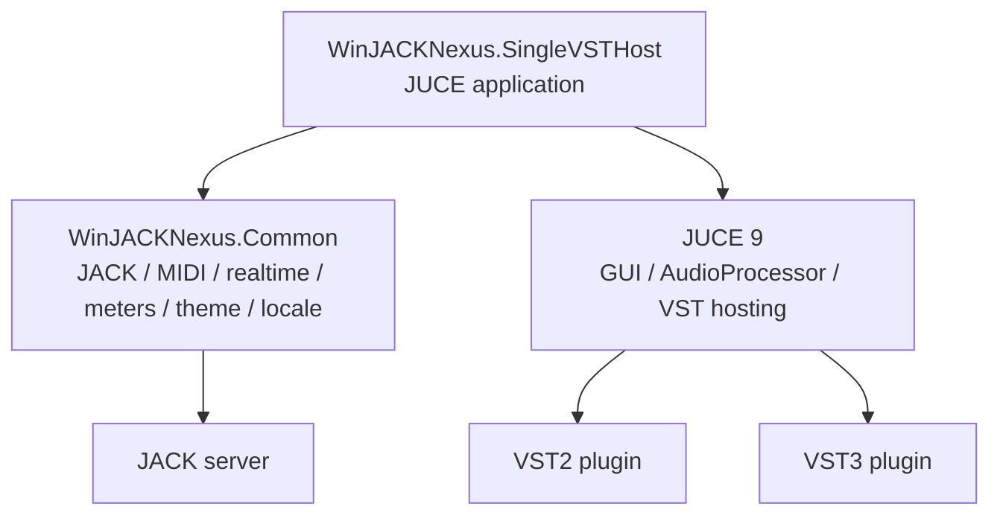

# WinJACKNexus.SingleVSTHost 开发计划书

> **版本**：1.0  
> **日期**：2026-08-17  
> **状态**：规划中  
> **目标模块**：`WinJACKNexus.SingleVSTHost`  
> **来源工程**：`ref/vsthost`  
> **目标平台**：Windows 10/11（Win32/x86 与 x64 双平台，插件必须与宿主位数匹配）


## 目录

- [一、目标与范围](#一目标与范围)
- [二、继承特性与明确精简](#二继承特性与明确精简)
- [三、现状基线与迁移原则](#三现状基线与迁移原则)
- [四、总体架构](#四总体架构)
- [五、功能设计](#五功能设计)
- [六、Common 复用边界](#六common-复用边界)
- [七、目标目录与工程接入](#七目标目录与工程接入)
- [八、实施阶段](#八实施阶段)
- [九、测试与验收矩阵](#九测试与验收矩阵)
- [十、风险、依赖与回退策略](#十风险依赖与回退策略)
- [十一、交付物与完成定义](#十一交付物与完成定义)

---

## 一、目标与范围

### 1.1 总体目标

将 `ref/vsthost` 合并为 WinJACKNexus 套件中的独立应用 `WinJACKNexus.SingleVSTHost`，以 JUCE 完整重写宿主的应用层、插件加载层、音频处理层、编辑器嵌入层和用户界面，并复用 `WinJACKNexus.Common` 已有的实时音频、JACK、MIDI、计量、主题、系统字体、本地化和通用控件能力。

目标不是把旧 MFC 工程原样搬入主工程，而是保留用户可见行为和稳定的数据契约，重新建立符合 WinJACKNexus 依赖方向的 JUCE/CMake 模块。

### 1.2 产品定位

`WinJACKNexus.SingleVSTHost` 是一个“一实例一个 VST 插件”的轻量宿主：

- 每个进程只加载一个 VST2 或 VST3 插件实例。
- 支持同名自动加载、命令行加载和拖放加载。
- 支持 WaveShell 内部效果器识别、选择和状态隔离。
- 通过 JACK 提供插件音频和 MIDI 的实时输入/输出端口。
- 直接嵌入插件原生编辑器，或在没有原生编辑器时提供 JUCE 参数界面。
- 使用 WinJACKNexus 统一的主题、系统字体、中文本地化、单实例/窗口、实时线程和配置持久化约定。

### 1.3 本计划不包含

- 不在本阶段实现新的音频后端。
- 不保留 ASIO、ASIO 驱动选择、ASIO 控制面板、ASIO 通道映射、采样率/缓冲设置或任何 ASIO 回退逻辑。
- 不保留旧的 MME、DirectSound、WaveDev、DSoundDev 或旧工作线程后端。
- 不把旧 MFC 窗口、资源脚本、MDI 机架、链路编辑器或旧 `.vcxproj` 纳入新模块。
- 不把旧的完整响度分析、电平表历史曲线、LUFS/LRA/True Peak/CSV 响度日志设置带入本模块。

---

## 二、继承特性与明确精简

### 2.1 必须继承的 WinJACKNexus 项目特性

除第 2.2 节列出的精简项外，SingleVSTHost 必须遵守 WinJACKNexus 现有项目约定，并与其他模块保持一致：

| 类别 | 继承内容 |
|---|---|
| 工程 | 顶层 CMake、C++20、JUCE 9、MSVC/Ninja、`modules/` 模块化目录和 `WinJACKNexus.<Module>` target 命名 |
| 依赖方向 | `SingleVSTHost -> Common`；Common 不依赖 SingleVSTHost，应用不直接复制 Common 的 JACK/DSP/UI 实现 |
| 音频实时性 | JACK process 回调无分配、无锁、无文件 I/O、无 UI 调用；结构变更在控制线程准备后于 block 边界提交 |
| JACK | 使用 Common 的统一 JACK client、音频端口、MIDI 端口、采样率/块大小回调、xrun 和服务器关闭状态；应用层不直接操作 JACK C API |
| MIDI | 使用 Common 的 `MidiEvent`、固定容量队列和双向 JACK MIDI 能力，保留 frame offset、SysEx/事件容量限制和丢事件计数 |
| UI | 全部使用 JUCE `Component`/`DocumentWindow`/`AudioProcessorEditor`，复用 `NexusLookAndFeel`、主题 token、平面控件、焦点状态和窄窗口约定 |
| 字体 | 统一使用操作系统 UI 字体及系统回退链；不加载、注册或打包自定义字体 |
| 本地化 | 用户可见普通文案默认简体中文，接入 Common 的 `.lang`、`LocaleManager` 和回退链；技术名词可按白名单保留 `VST`、`VST3`、`JACK`、`MIDI` 等原文 |
| 主题 | 支持 Common 默认主题和 `Common + SingleVSTHost` 模块覆盖；主题加载、ZIP/JSON 解析和资源缓存不进入实时线程 |
| 配置 | 使用 UTF-8 JSON 和原子替换写入；版本字段、未知字段处理、损坏文件回退和迁移规则与其他模块一致 |
| 窗口 | 继承 JUCE 桌面应用的 DPI 感知、托盘/关闭流程、窗口状态恢复、主题切换和多实例生命周期约定 |
| 诊断 | 通过非实时状态快照报告插件加载错误、JACK 状态、xrun、端口变化、MIDI 丢事件、处理超时和 UI 降级状态 |
| 发布 | 开发/编译使用仓库已有 JUCE、VST SDK 和 JACK2 依赖；JACK2 的头文件和 `.lib` 仅为开发/链接输入，按项目现有口径不把 `libjack64.dll` 自动加入发布包 |

本计划中的“后端”特指音频采集、处理和输出后端。为继承原宿主的 MIDI 能力，JACK MIDI 是标准路径；若保留系统 MIDI 设备输入/输出，则使用 JUCE 的 MIDI API 或 Common 的消息桥接作为独立消息源/汇，不把它定义为第二条音频后端，也不恢复任何 ASIO 设备设置。

### 2.2 明确精简项

#### 2.2.1 后端精简：只保留 JACK

SingleVSTHost 的产品模型只存在一个后端：`JACK`。

删除或不迁移以下内容：

- `AsioBackend`、`AsioHost`、`SpecAsioHost`、`AsioMapDialog`。
- ASIO 设备/驱动列表、控制面板、通道映射、采样率、缓冲区和 MIDI 设置。
- 默认 ASIO 设备、FL Studio ASIO 选择、ASIO 与 JACK 互斥切换和 JACK 失败回退 ASIO。
- MME、DirectSound、Wave、旧 `CWorkThread` 后端路径。
- 配置中的 `backend`、`asio`、`driver`、`samplerate`、`buffersize`、`AsioMap` 等字段。

保留的音频设置只描述 JACK 实际协商结果和应用级偏好：

- JACK client 名称。
- JACK 端口命名/连接策略。
- 是否启动时尝试恢复已保存的 JACK 连接。
- 当前服务器报告的采样率和 block size（只读状态，不提供应用侧强制设置）。
- 插件输入/输出总线与 JACK 端口的映射策略。

JACK 未运行时，应用显示明确的“JACK 未连接”状态并保持插件/界面可诊断；不得启动其他后端替代，也不得因 JACK 不可用而偷偷改变产品配置。

#### 2.2.2 电平表精简：只保留多通道输入/输出峰值表

保留一个轻量、实时安全的峰值计量视图：

- 输入通道峰值表：按插件实际输入通道数显示。
- 输出通道峰值表：按插件实际输出通道数显示。
- 每个通道显示当前峰值、峰值保持状态和过载状态；峰值保持时长可作为轻量显示偏好保留。
- 表数量、通道名、JACK 端口名和插件实际总线/通道布局保持同步。
- 表数据来自 Common 的 `LevelMeterProbe`/`MeterFrame` 或等价共享契约，UI 只消费原子快照。
- 支持无信号、静音、过载、JACK 断开、插件未加载和通道数变化等状态。

不迁移以下计量功能：

- Momentary、Short-term、Integrated LUFS。
- LRA、True Peak/dBTP、响度标准和参考线。
- 响度预设、静音触发响度重置、历史曲线和独立响度分析窗口。
- 响度 CSV 日志、日志间隔、日志目录和记录开关。
- 原 `LoudnessCore`、`LevelMeterDlg`、`MeterSettingsDlg` 及其响度配置字段。

峰值表不是新的产品级响度模块；它只承担输入/输出信号是否存在、是否接近削波以及各通道相对电平的快速观察。

### 2.3 功能继承与精简对照

| `ref/vsthost` 功能 | SingleVSTHost 处理 |
|---|---|
| VST2 单插件加载 | 保留，改为 JUCE VST2 hosting 适配 |
| VST3 单插件加载 | 保留，改为 JUCE VST3 hosting 适配 |
| 同名自动加载 | 保留 |
| 命令行加载 | 保留 |
| 拖放加载 | 保留 |
| WaveShell 内部效果器 | 保留，先验证 JUCE hosting 可行性；选择、切换和状态隔离由应用模型负责 |
| 插件原生编辑器 | 保留，使用 JUCE `AudioProcessorEditor`/插件 editor 嵌入 |
| 无 editor 时的参数界面 | 保留 JUCE 通用参数界面或明确的无 editor 空状态 |
| VSTi/MIDI 插件能力 | 保留，MIDI 由 JACK 端口提供 |
| MIDI CC 参数映射 | 保留，基于 Common 事件和插件参数模型 |
| JACK 音频端口 | 保留并迁入 Common 统一实现 |
| JACK MIDI 输入/输出 | 保留并迁入 Common 统一实现 |
| 多实例 | 保留；每个进程一个插件实例，JACK client 名称和状态文件隔离 |
| 插件状态自动保存 | 保留，改为 JSON/插件状态二进制的原子保存模型 |
| 托盘、关闭行为、DPI、主题跟随 | 保留并使用 JUCE/Common 实现 |
| DWM 视觉集成 | 保留目标行为；Windows 特定 API 只放在 JUCE 窗口适配层，不污染 Common 音频路径 |
| MME/DirectSound/ASIO | 删除 |
| 完整响度和多指标电平表 | 删除，仅保留多通道 I/O Peak |
| MDI/多插件/效果链 | 删除，保持单插件单窗口 |
| 虚拟 MIDI 键盘 | 删除；测试 MIDI 使用外部 JACK MIDI 端口或独立测试工具 |
| Shell 拆包/包装器工具 | 保留并迁移为独立 JUCE/CMake 工具 target；不得成为 SingleVSTHost 运行时依赖 |

---

## 三、现状基线与迁移原则

### 3.1 旧工程现状

`ref/vsthost/src/` 中已经完成部分单插件化的 Win32/MFC 实现：

- `app/`：应用入口、主窗口、托盘和菜单。
- `host/`：`IPlugin`、`Vst2Plugin`、`Vst3Plugin`、`SingleHost`、`JackBackend`、旧 `AsioBackend`、MIDI 输入输出。
- `dsp/`：旧完整 `LoudnessCore`。
- `ui/`：旧 MFC 电平表、设置、参数映射和关闭对话框。
- `tool/`、`wrapper/`：Shell 拆包和包装器工具。

旧工程通过 `vsthost.vcxproj` 编译，依赖旧的 Win32/MFC 窗口、VST2/VST3 SDK 和 ASIO SDK。新模块不得继续依赖 MFC、旧 `.rc` 菜单资源或旧工程文件。

### 3.2 迁移原则

1. **行为先于文件**：以旧计划书、说明书和实际代码行为为功能基线，不按文件名机械复制。
2. **JUCE 统一入口**：应用、窗口、菜单、文件拖放、编辑器嵌入、计时器、线程、参数控件和状态通知全部使用 JUCE；旧 MFC 类不进入新 target。
3. **Common 优先复用**：已有 JACK、MIDI、实时队列、MeterFrame、主题、系统字体、本地化和单实例能力先在 Common 中确认接口，再由 SingleVSTHost 消费。
4. **应用层不直接碰 JACK C API**：JACK client、端口、process callback、MIDI buffer 和 JACK 生命周期由 Common 封装；SingleVSTHost 只处理插件缓冲和路由意图。
5. **实时路径最小化**：插件 process 与 JACK process 之间只传递预分配的音频视图、固定容量 MIDI 事件和峰值快照，不做配置读取、内存分配、日志和 UI 操作。
6. **明确移除旧设置**：删除 ASIO 和完整响度相关配置，而不是在新 UI 中隐藏旧字段；旧配置迁移时忽略并报告已废弃字段。
7. **按插件能力建端口**：JACK 音频端口数量、端口名和 MIDI 端口存在性由当前插件总线/事件能力决定，不写死为 2 进 2 出。
8. **先建立可行性门槛**：VST2/VST3 host、WaveShell、多总线、原生 editor、JACK 实时处理和插件位数矩阵必须在进入大规模迁移前各有最小验证。

### 3.3 许可证与第三方边界

- `third_party/JUCE`、`third_party/vst2sdk`、`third_party/vst3sdk`、`third_party/JACK2` 仍作为独立第三方依赖，不复制或改写其许可文件。
- 迁移 `ref/vsthost` 的代码前确认原项目与上游 VSTHost 的许可证范围，保留必要的 LGPL/上游致谢和来源记录。
- 新模块源码使用 `wjn::single_vst_host` 命名空间；Common 继续使用 `wjn::common`。
- `ref/vsthost` 在本模块全部功能验收前保留为只读参考；最终是否归档由跨模块收尾计划统一处理。

---

## 四、总体架构

### 4.1 依赖关系



禁止方向：

- Common 不依赖 SingleVSTHost 的插件模型、窗口、菜单或状态文件。
- SingleVSTHost 不直接编译一份新的 JACK client、MIDI queue、主题引擎或通用电平表。
- 插件适配层不得反向依赖具体 UI 对话框。
- `shell2vst` 包装器若迁移，作为独立 target，不成为主应用启动或处理路径的隐式依赖。

### 4.2 线程与实时边界

```text
JUCE Message Thread
  - 主窗口、插件编辑器、菜单、托盘、主题/语言切换
  - 插件加载/卸载、Shell 内部效果器切换
  - JACK 连接策略和端口布局变更请求
  - 配置与插件状态保存命令

JACK Process Thread
  - 从 Common JACK input ports 读取音频/MIDI
  - 写入预分配的插件输入视图
  - 调用当前插件 process
  - 写出插件音频和 MIDI
  - 更新输入/输出 Peak 快照

Preparation / Control Thread
  - 构建插件实例和 ProcessSpec
  - 分配/重建音频缓冲和端口映射
  - 处理采样率、block size、总线布局变化
  - 生成下一份不可变运行快照

Persistence / Diagnostic Thread
  - JSON 配置、插件状态、日志和诊断快照
  - 处理异步错误、丢包计数和运行统计
```

JACK process 回调和插件 process 路径禁止：

- `new`、`delete`、容器扩容、字符串拼接和不可控的第三方分配。
- 互斥锁、条件变量、文件 I/O、JSON/XML 解析和控制台输出。
- 访问 JUCE `Component`、触发 `repaint()`、创建窗口或发送阻塞消息。
- 插件加载、卸载、总线重建和 editor 操作。

### 4.3 单插件运行模型

```text
SingleVSTHostApplication
└── SingleVSTHostMainWindow
    ├── PluginLoadCoordinator
    │   ├── PluginIdentityResolver
    │   ├── Vst2/Vst3 JUCE format adapter
    │   └── ShellInternalSelector
    ├── SinglePluginRuntime
    │   ├── juce::AudioPluginInstance
    │   ├── PluginStateStore
    │   ├── ParameterBridge
    │   └── EditorHostComponent
    ├── JackRuntimeAdapter -> WinJACKNexus.Common
    ├── PeakMeterModel -> WinJACKNexus.Common
    └── Common theme / locale / tray / window services
```

运行时只允许一个当前插件实例。加载新插件或切换 Shell 内部效果器时执行：

1. 停止 JACK 音频处理。
2. 保存旧实例状态和当前 UI/参数快照。
3. 关闭 editor 并释放旧实例。
4. 解析新插件/内部组件并创建 JUCE `AudioProcessor`。
5. 按实际总线布局准备 process buffer、JACK 端口和 Peak meter。
6. 恢复目标插件或目标内部组件的状态。
7. 启动 JACK 处理并刷新 UI 状态。

任何一步失败都回退到“未加载插件 + 可诊断”状态，不以半初始化对象继续运行。

### 4.4 插件格式适配

优先使用 JUCE 9 `juce_audio_processors` 提供的 `VSTPluginFormat` 和 `VST3PluginFormat`：

- `AudioPluginFormatManager` 管理格式。
- `PluginDescription` 作为应用层插件身份和缓存键。
- `AudioPluginInstance` 作为统一处理接口。
- `AudioProcessorEditor` 作为编辑器嵌入入口。
- `AudioProcessorValueTreeState`/参数快照承载参数控制和 MIDI CC 映射。
- `getStateInformation`/`setStateInformation` 承载插件状态。

应用层不直接复刻旧 `AEffect`、VST3 `IComponent`、`ProcessData` 和 editor window 代码。若 JUCE 公共 hosting API 对 WaveShell 内部组件枚举或某个插件兼容性能力不足，先在 Common/插件适配边界增加最小 JUCE-facing 扩展，并记录其 SDK 依赖、许可证和测试；不得把旧 MFC 宿主整体搬入。

---

## 五、功能设计

### 5.1 插件发现与加载

#### 同名自动加载

应用启动时按以下顺序解析插件：

1. 命令行显式路径优先：`WinJACKNexus.SingleVSTHost.exe <plugin-path>`。
2. 没有命令行路径时读取自身可执行文件名主干。
3. 同目录优先查找同名 `.vst3`，同时支持 VST3 目录包和单文件；若不存在再查找同名 VST2 `.dll`。
4. 若仍未找到，显示中文诊断，并提供 JUCE 文件选择器和拖放入口。
5. 插件位数不匹配、模块损坏、依赖缺失或创建失败时，显示格式、路径、位数和错误原因。

加载成功后，窗口标题和 JACK client 名称使用清洗后的插件显示名；同名多实例追加稳定序号，避免 JACK client 名称冲突。x86 宿主只加载 x86 插件，x64 宿主只加载 x64 插件。

#### 拖放与替换

- 接受 `.dll`、`.vst3` 文件或 VST3 目录拖放。
- 拖入新插件前先保存当前插件状态。
- 拖入路径不支持、格式不匹配或创建失败时保留旧插件运行状态，除非旧实例已明确被用户关闭。
- 不提供多插件列表、机架、链路或并行插件槽位。

### 5.2 VST2/VST3 宿主能力

保留旧宿主已具备的单插件能力，但统一通过 JUCE API 实现：

- 音频输入/输出总线查询与动态通道映射。
- VSTi/乐器插件识别：有 MIDI 输入能力时注册 JACK MIDI 输入端口。
- 插件参数枚举、参数名称/显示值、自动化和 MIDI CC 映射。
- 插件程序/预设状态读取和写回。
- 原生 editor 嵌入、尺寸变化、焦点、键盘和 DPI 处理。
- 无 editor 时使用 JUCE 通用参数编辑器或明确的空编辑器状态。
- 插件 idle/消息泵行为由 JUCE editor 和消息线程管理，不在 JACK process 回调中执行。

JACK MIDI 是插件事件的默认入口；原宿主的系统 MIDI 设备输入/输出若在 M0 确认继续保留，则以 JUCE MIDI 设备 API 接入并汇入同一 Common 事件契约，不增加独立音频后端或 ASIO 设置页。

VST3 多总线必须按启用的音频输入/输出总线展开成实际通道布局；VST2 的 `numInputs/numOutputs` 通过 JUCE 适配层转换为相同的应用契约。

### 5.3 WaveShell 与内部效果器

保留 `ref/vsthost` 的 WaveShell 使用场景，但将实现责任从旧对话框移到 JUCE 应用模型：

- 仅对文件名包含 `WaveShell`（忽略大小写）的模块启用内部效果器识别。
- 内部效果器列表通过 JUCE 可用的 hosting 能力或受控的 JUCE-facing 扩展取得。
- 不再使用 `ShellSelDlg`；使用 JUCE 菜单/命令系统提供“插件 -> 内部效果器”单选菜单。
- 默认加载上次选择的内部 UID；没有记录时选择第一个可用内部效果器。
- 支持 `(Shell文件名)内部效果器名.exe` 的同名直选约定。
- 切换内部效果器时停止音频、保存当前 UID 状态、销毁实例、创建目标实例、恢复目标状态、重新计算通道/端口并恢复 JACK 处理。
- 每个内部效果器按稳定 UID 隔离参数和插件状态，不能互相覆盖。
- 当 JUCE hosting 无法枚举目标 shell 时，启动阶段必须明确报告“不支持该 shell”，不能静默当作普通插件加载并产生错误状态。

Shell 拆包、VST2/VST3 wrapper 和快捷方式生成工具不属于主应用运行时，但作为原有交付能力保留。它们迁移为独立 JUCE/CMake target，必须依赖同一套 JUCE-facing 插件身份与命名契约，不能继续依赖旧 MFC 工程或旧主应用 target。

### 5.4 JACK 音频与 MIDI

SingleVSTHost 只通过 Common 使用 JACK：

- JACK client 名称：`SingleVSTHost_<插件名>_<实例序号>`，最终名称遵守 JACK 长度和非法字符限制。
- 插件每个实际输入通道注册一个 JACK 输入端口，插件每个实际输出通道注册一个 JACK 输出端口。
- 输入/输出端口名优先使用插件总线或通道名称；无名称时回退到 `in_1..N` / `out_1..M`。
- 插件有事件/MIDI 输入能力时注册 `midi_in`；插件有事件/MIDI 输出能力时注册 `midi_out`；无能力时不注册无意义端口。
- 默认不自动连接外部端口；配置可保存用户明确的连接恢复意图，恢复失败只显示诊断，不阻止宿主打开插件。
- JACK 采样率和 block size 由服务器权威决定，Common 回调通知控制层后重新准备 JUCE `ProcessSpec`。
- JACK server shutdown、xrun、buffer size 变化、端口断开/重连均通过非实时状态快照通知界面。
- 插件输出无有效数据时清零 Common JACK output block，避免沿用上一块数据。

MIDI 事件约束：

- 读取 JACK MIDI 时保留 frame offset 和 payload；写出插件事件时保留事件发生位置。
- SysEx 或超容量事件按 Common 固定容量规则处理，并增加原子丢事件计数。
- 不在实时回调中创建 `juce::MidiBuffer` 的不可控扩容路径；需要的容量在准备阶段固定或采用 Common 的预分配事件契约。
- MIDI CC 映射在控制线程构建只读映射快照，实时线程只查固定结构并提交参数意图。

### 5.5 多通道输入/输出峰值表

#### 数据模型

每个输入/输出通道至少提供：

```text
PeakChannelFrame
  channelIndex
  displayName
  currentPeakDb
  peakHoldDb
  clipping
  hasSignal
  timestamp
```

- Peak 计算在实时路径使用 Common 的 `LevelMeterProbe` 或等价预分配实现。
- UI 定时读取完整快照，不直接读取插件/JACK buffer。
- 无信号时显示项目统一的无信号文案/数值状态；插件未加载时显示空状态。
- 通道数变化时，控制层先重建快照和 UI，再提交新的 JACK 端口布局。

#### UI 设计

- 主窗口以插件 editor 为核心区域，输入峰值表和输出峰值表作为两侧或可折叠的 JUCE 面板。
- 通道数多时使用横向/纵向可滚动的固定尺寸通道表，不压缩到文字和数值重叠。
- 峰值表使用 Common 的 `MeterComponent`/主题 token；不创建 SingleVSTHost 专用重复电平绘制基础类。
- 颜色、峰值保持、过载指示、窄窗口布局和无贴图回退遵守 Common 现有扁平控件规范。
- 不提供独立响度窗口、历史图表、标准选择器和 CSV 控件。

### 5.6 配置与插件状态

建议配置文件：`single_vst_host.json`，位于应用/插件约定的可写配置目录；插件状态按插件路径、格式和内部 UID 隔离。

最小配置结构：

```json
{
  "format": "WinJACKNexus.SingleVSTHost",
  "version": 1,
  "plugin": {
    "path": "D:/Plugins/Foo.vst3",
    "format": "VST3",
    "internalUid": "",
    "lastStateFile": "Foo.vstpreset"
  },
  "jack": {
    "clientName": "SingleVSTHost_Foo_1",
    "autoReconnect": false,
    "inputBindings": [],
    "outputBindings": [],
    "midiInputBinding": null,
    "midiOutputBinding": null
  },
  "ui": {
    "windowBounds": {},
    "meterVisible": true,
    "trayMode": "ask",
    "themePath": null,
    "locale": "zh-CN"
  },
  "midi": {
    "ccMappings": []
  }
}
```

规则：

- 不保存 ASIO、MME、DirectSound、驱动、ASIO 采样率、ASIO buffer、ASIO channel map 或响度字段。
- 旧 `.ini`/旧 JSON 中的 ASIO 和响度字段在迁移时忽略，写入一次非实时诊断；不得把旧字段继续写回新配置。
- 插件状态使用插件自身的 state data，以临时文件写入并原子替换；VST2/VST3 使用各自扩展名或统一内部状态容器，但必须保留格式和版本信息。
- Shell 内部效果器按稳定 UID 分文件或分区保存；不同实例使用实例序号或实例 ID 隔离状态文件。
- 配置写入失败不覆盖上一份有效配置；退出时按“保存配置 -> 保存插件状态 -> 停止 JACK -> 销毁插件”顺序执行。
- 配置加载不要求 JACK 当前可用；端口绑定可以先标记为未解析，待 JACK 恢复后由控制线程尝试重连。

### 5.7 托盘、窗口和系统集成

保留并 JUCE 化旧宿主的系统工作流：

- 支持最小化到托盘、左键/双击恢复、右键菜单显示/退出。
- 关闭按钮遵循“询问/最小化到托盘/完全退出”设置；“文件 -> 退出”直接完全退出。
- 使用 JUCE `DocumentWindow`/`Component` 实现 DPI 感知和插件 editor 嵌入。
- Windows 特定的 DWM 深色标题栏、Win11 圆角和主题变更监听集中在窗口适配类；API 不可用时静默回退 JUCE 默认窗口外观。
- 允许多实例，不使用会阻止同一插件重复打开的全局互斥；实例间只共享只读资源，配置和插件状态必须隔离。
- 窗口标题、托盘提示、错误对话框和状态栏默认使用 `zh-CN` 文案。

---

## 六、Common 复用边界

### 6.1 应优先复用或扩展到 Common 的能力

| 能力 | Common 职责 | SingleVSTHost 职责 |
|---|---|---|
| JACK client | 创建/激活/停止/关闭 client，服务器状态，生命周期 | 提供插件期望的端口布局和处理回调 |
| 插件 hosting | `Common/Plugin` 提供 JUCE format registry、统一实例/参数/事件/状态契约及可复用 editor host 边界 | SingleVSTHost 决定同名加载、单实例策略、Shell 菜单和产品工作流 |
| JACK 音频 | 注册 input/output 端口，获取/清零 buffer，采样率和 block size | 把插件缓冲映射到 Common 端口 |
| JACK MIDI | 事件读取/写入、frame offset、容量和丢包计数 | 将 Common 事件转换为 JUCE 插件事件并消费插件输出 |
| 实时队列 | SPSC 音频/MIDI 队列、固定容量、原子计数 | 选择队列容量和绑定插件 process block |
| 音频数据 | `AudioProcessContext`、通道布局、block 契约 | 构建插件 `AudioBuffer`/总线视图 |
| 峰值计量 | `LevelMeterProbe`、`MeterFrame`、Peak hold 数据契约 | 将输入/输出快照绑定到 UI |
| 主题 | `ThemeContext`、`NexusLookAndFeel`、资源缓存 | 声明 `SingleVSTHost` 模块 token 并消费主题 |
| 字体 | 操作系统 UI 字体选择和系统回退 | 选择控件用途和逻辑字体 ID |
| 本地化 | `.lang` 解析、回退和文本目录 | 提供 SingleVSTHost 业务键和错误上下文 |
| 单实例/窗口辅助 | 仅复用项目已定义、与应用模型无关的能力 | 决定 SingleVSTHost 的多实例策略和窗口绑定 |
| 通用序列化 | JSON 校验、原子文件写入等稳定 helper | 定义插件、JACK、UI、MIDI 的模块 schema |

### 6.2 不应放入 Common 的能力

- `SinglePluginRuntime`、VST2/VST3 当前插件对象和 Shell 当前 UID。
- 同名文件解析、当前插件选择、单实例运行策略仍属于 SingleVSTHost；通用的 JUCE VST2/VST3 hosting 适配、参数/事件/状态契约应优先放在 `Common/Plugin`，供未来宿主类模块复用。
- 插件文件命名解析、同名 exe 规则和 SingleVSTHost 菜单命令。
- 插件 editor 的具体布局、窗口标题和单插件 UI 状态。
- `.fxp`/`.vstpreset` 的应用级文件命名策略（Common 只提供通用原子写入和二进制状态容器能力）。
- SingleVSTHost 的托盘菜单、DWM 窗口样式和插件专用错误文案。
- 已明确删除的 ASIO、响度分析、历史曲线和完整电平表逻辑。

### 6.3 Common 需要新增/调整的候选 API

具体类名以实现阶段代码审查为准，职责应覆盖：

```text
Common/Audio/
  JackPluginPortMap.h/.cpp
  JackPluginProcessBridge.h/.cpp
  PluginAudioBlock.h
  ChannelLayout.h

Common/Plugin/
  PluginInstance.h
  PluginFormatRegistry.h/.cpp
  PluginParameterBridge.h/.cpp
  PluginEventBridge.h/.cpp
  PluginStateBlob.h/.cpp
  PluginEditorHost.h/.cpp
  ShellComponentCatalog.h/.cpp

Common/MIDI/
  MidiEvent.h
  MidiEventQueue.h/.cpp
  JackMidiInput.h/.cpp
  JackMidiOutput.h/.cpp

Common/DSP/
  LevelMeterProbe.h/.cpp
  PeakFrame.h

Common/IO/
  AtomicStateFile.h/.cpp
  JsonFileStore.h/.cpp

Common/UI/
  MeterComponent.h/.cpp
  PluginEditorShellComponent.h/.cpp（仅在被多个 APP 复用时进入 Common）
```

这些候选 API 必须先证明有跨应用复用价值；只被 SingleVSTHost 使用的插件业务逻辑保留在 `modules/WinJACKNexus.SingleVSTHost/Source/`。

---

## 七、目标目录与工程接入

### 7.1 目标目录

```text
WinJACKNexus/
├── docs/
│   └── WinJACKNexus.SingleVSTHost_开发计划书.md
├── modules/
│   ├── WinJACKNexus.Common/
│   └── WinJACKNexus.SingleVSTHost/
│       ├── CMakeLists.txt
│       ├── Resources/
│       │   ├── single_vst_host_icon.png
│       │   └── default_config.json（可选示例，不保存用户状态）
│       ├── Source/
│       │   ├── Main.cpp
│       │   ├── App/
│       │   │   ├── SingleVSTHostApplication.h/.cpp
│       │   │   ├── SingleVSTHostMainWindow.h/.cpp
│       │   │   ├── TrayController.h/.cpp
│       │   │   └── DwmWindowAdapter.h/.cpp
│       │   ├── Host/
│       │   │   ├── SinglePluginRuntime.h/.cpp
│       │   │   ├── PluginLoadCoordinator.h/.cpp
│       │   │   ├── PluginIdentityResolver.h/.cpp
│       │   │   ├── PluginFormatAdapter.h/.cpp
│       │   │   ├── ShellInternalSelector.h/.cpp
│       │   │   ├── PluginStateStore.h/.cpp
│       │   │   └── PluginBitnessValidator.h/.cpp
│       │   ├── Audio/
│       │   │   ├── JackPluginEngine.h/.cpp
│       │   │   ├── PluginProcessBridge.h/.cpp
│       │   │   └── JackRouteModel.h/.cpp
│       │   ├── MIDI/
│       │   │   ├── MidiParameterMap.h/.cpp
│       │   │   └── PluginMidiBridge.h/.cpp
│       │   ├── Model/
│       │   │   ├── SingleVSTHostConfig.h/.cpp
│       │   │   ├── PluginSessionState.h/.cpp
│       │   │   └── PeakMeterModel.h/.cpp
│       │   └── UI/
│       │       ├── MainComponent.h/.cpp
│       │       ├── PluginEditorHostComponent.h/.cpp
│       │       ├── InputPeakMeterPanel.h/.cpp
│       │       ├── OutputPeakMeterPanel.h/.cpp
│       │       ├── PluginMenuModel.h/.cpp
│       │       ├── SettingsComponent.h/.cpp
│       │       └── ErrorStateComponent.h/.cpp
│       └── tests/
│           ├── PluginIdentityResolverTests.cpp
│           ├── SingleVSTHostConfigTests.cpp
│           ├── PeakMeterModelTests.cpp
│           ├── MidiParameterMapTests.cpp
│           └── JackPluginBoundaryTests.cpp
```

目录名和类名为规划建议；实现阶段可以按现有 Common 风格调整，但不得改变模块职责和依赖方向。

### 7.2 CMake 接入原则

在顶层 `CMakeLists.txt` 中新增：

```cmake
add_subdirectory(modules/WinJACKNexus.SingleVSTHost)
```

模块 target 采用：

```text
WinJACKNexus.SingleVSTHost
```

CMake 目标要求：

- 使用 `juce_add_gui_app`。
- 链接 `WinJACKNexus.Common`、`juce::juce_core`、`juce::juce_events`、`juce::juce_graphics`、`juce::juce_gui_basics`、`juce::juce_gui_extra`、`juce::juce_audio_basics`、`juce::juce_audio_processors` 和项目实际需要的 JUCE 模块。
- 不链接 ASIO SDK，不引入 `AsioHost`、`asiodrivers`、ASIO 控制面板或旧 MFC 库。
- VST2/VST3 hosting 使用 JUCE 9 的配置开关和对应 SDK 目录；SDK 只作为 JUCE hosting 的构建依赖，不在应用层重新实现 VST ABI。
- 遵循 JUCE 9 现有 target 规则，使用 `juce::juce_recommended_config_flags` 和 `juce::juce_recommended_warning_flags`。
- 通过 CommonResources/模块 post-build 规则复制语言文件，不在应用内实现字体资源安装或自定义字体加载。
- 新增 target 后更新顶层资源依赖、CTest 和文档中的模块列表。

### 7.3 旧文件处置

迁移完成前保留 `ref/vsthost` 全部内容作为参考。SingleVSTHost target 不得引用：

- `ref/vsthost/src/app/*.cpp` 的 MFC 应用窗口实现。
- `ref/vsthost/src/host/AsioBackend.*` 及所有 ASIO 文件。
- `ref/vsthost/src/dsp/LoudnessCore.*`。
- `ref/vsthost/src/ui/LevelMeterDlg.*`、`MeterSettingsDlg.*` 及响度设置资源。
- `vsthost.sln`、`vsthost.vcxproj` 和旧 `.rc` 资源。

旧 `tools/pack.ps1`、`shell2vst` 和 wrapper 是否迁移，必须作为独立工具任务审查，不能因为主应用迁移而自动进入主 target。

---

## 八、实施阶段

### M0：基线、可行性和需求冻结

**目标**：建立可复现的迁移基线，先排除关键依赖风险。

任务：

1. 锁定当前 WinJACKNexus Common/Adapter/MeterBridge 可构建基线和 CTest 基线。
2. 确认 JUCE 9 的 VST2/VST3 hosting 配置、VST2/VST3 SDK 版本、插件位数支持和 Windows 加载路径。
3. 用最小 JUCE host 验证：加载一个普通 VST2、一个普通 VST3、一个带原生 editor 的插件，并完成初始化/处理/关闭。
4. 验证 WaveShell 内部组件枚举、UID 选择、状态读写和 editor 创建；若 JUCE 公共 API 不足，形成最小扩展方案和许可证记录。
5. 验证 Common JACK 音频/MIDI 包装可以承载插件实际通道数和动态 port map，并确认可复用的 JUCE plugin hosting 契约可以独立编译到 `Common/Plugin`。
6. 确认 Win32/x86 与 x64 都是交付目标，建立两套构建和插件加载矩阵；插件位数不匹配时必须明确拒绝并提示对应宿主版本。
7. 冻结新配置 schema、插件状态路径、JACK 端口命名、错误状态和中文文案键。

验收：普通 VST2/VST3 最小 host 可构建、加载、处理和关闭；JACK 不可用时能进入可诊断状态；WaveShell 的支持结论和后续路径有明确记录；没有 ASIO 或响度字段进入新 schema。

### M1：JUCE 应用骨架与 Common 接入

**目标**：建立可启动的 `WinJACKNexus.SingleVSTHost` JUCE target。

任务：

1. 新建 `modules/WinJACKNexus.SingleVSTHost` 和 `CMakeLists.txt`，接入顶层 CMake。
2. 建立 `JUCEApplication`、主窗口、托盘、DPI、主题、本地化和错误状态骨架。
3. 接入 Common `NexusLookAndFeel`、系统字体、`.lang` 和单实例/窗口辅助能力；按产品策略允许多实例。
4. 建立配置加载/保存、版本校验、原子写入和旧字段忽略路径。
5. 建立插件 editor 容器和未加载插件空状态。
6. 删除 UI 设计中的 ASIO/响度入口，从初版菜单结构中不出现废弃设置。

验收：应用独立启动、关闭、最小化到托盘、恢复窗口、切换主题/语言；构建产物 target 名称正确；配置损坏或缺失时可回退到空宿主；UI 不显示 ASIO 或响度设置。

### M2：JUCE VST2/VST3 单插件加载

**目标**：完成普通 VST2/VST3 的单实例生命周期。

任务：

1. 实现同名、命令行和拖放插件解析。
2. 在 `Common/Plugin` 接入 JUCE `AudioPluginFormatManager`、VST2/VST3 format 和 `AudioPluginInstance`；SingleVSTHost 只负责单插件策略和产品流程。
3. 实现插件初始化、总线查询、ProcessSpec、关闭和失败回退。
4. 实现原生 editor 嵌入、尺寸变化、DPI 和无 editor fallback。
5. 实现参数模型、程序/状态读取、参数快照和插件状态原子保存。
6. 实现多实例名称和状态路径隔离。
7. 增加插件位数/模块加载错误的中文诊断。

验收：至少一个 VST2 和一个 VST3 可从三种入口加载；插件可处理真实测试音频；editor 可打开/关闭/缩放；替换插件时旧实例状态不污染新实例；重启可恢复插件状态；没有 MFC 窗口或旧 `vsthost` target 依赖。

### M3：JACK 音频处理与动态端口

**目标**：把单插件 process 链路接入真实 JACK。

任务：

1. 使用 Common JACK client 和端口抽象创建 SingleVSTHost client。
2. 根据插件输入/输出总线注册动态音频端口，支持多总线和非 2 进 2 出布局。
3. 根据插件 MIDI 事件能力注册 `midi_in`/`midi_out`。
4. 建立 Common 音频 block 与 JUCE `AudioBuffer<float>`/总线视图之间的预分配桥接。
5. 处理 JACK 采样率、block size、xrun、server shutdown、端口断开和重连。
6. 在实时路径计算输入/输出 Peak，并将快照提供给 UI。
7. 明确插件 process 的实时限制；发现第三方插件阻塞/分配时只记录诊断，不在 JACK 回调中加入锁或补偿逻辑。

验收：

- 2 进 2 出插件显示对应 JACK 音频端口。
- 多通道插件显示与实际总线一致的 `in_N`/`out_M` 端口。
- 无 MIDI 能力的插件不注册 MIDI 端口；有输入/输出事件能力的插件注册对应端口。
- 外部 JACK 端口可接入并听到插件处理结果，输出无数据时不残留旧 block。
- JACK server 停止、block size 变化和 xrun 不导致崩溃或 UI 线程死锁。

### M4：JACK MIDI 与参数控制

**目标**：完成乐器、MIDI 效果器和参数映射工作流。

任务：

1. 将 Common `MidiEvent` 映射到 JUCE `MidiBuffer` 或预分配插件事件输入。
2. 将插件 MIDI 输出转换为 Common JACK MIDI 输出事件。
3. 保留 frame offset、通道过滤和超容量诊断。
4. 实现 MIDI CC 到插件参数的配置、校验、实时只读映射快照和持久化。
5. 提供外部 JACK MIDI 输入/输出验证路径；不迁移虚拟 MIDI 键盘。
6. 对 VSTi 与音频效果插件分别验证 MIDI 端口和输入峰值表显示语义。

验收：外部 JACK MIDI 键盘可驱动 VSTi；MIDI 效果器可接收/输出事件；CC 能稳定控制目标参数；重启后映射恢复；队列满时计数并保持音频线程不阻塞。

### M5：精简峰值表与完整 JUCE 工作流

**目标**：交付只包含 I/O 多通道 Peak 的产品 UI。

任务：

1. 实现输入/输出峰值表面板，按实际通道数动态生成固定尺寸通道表。
2. 接入 Common MeterFrame/PeakFrame、峰值保持、过载、无信号和 JACK 断开状态。
3. 将插件 editor、峰值表、状态栏、菜单、主题和中文文案组成稳定主窗口布局。
4. 完成托盘、关闭行为、窗口状态恢复、DWM 适配和多实例隔离。
5. 清理所有 ASIO、完整响度、电平历史和旧 MFC UI 文案、菜单、配置键和 target 残留。
6. 在 `locales/SingleVSTHost/zh-CN.lang` 增加必要业务文案；更新资源复制规则。

验收：主窗口可以在窄窗口和多通道场景下稳定布局；只显示输入/输出 Peak 表；搜索源码和菜单不再出现 ASIO 设置、LUFS/LRA/True Peak/CSV 响度入口；中文文案完整且未加载/错误/JACK 断开状态可理解。

### M6：WaveShell、工具和兼容性收尾

**目标**：完成高风险兼容功能和旧工程隔离。

任务：

1. 完成 WaveShell 内部效果器菜单、文件名直选、UID 状态隔离和切换后的 JACK 端口重建。
2. 对 VST2/VST3、多总线、VSTi、无 editor、editor 动态尺寸和多实例组合执行兼容性矩阵。
3. 审查 `shell2vst`、wrapper、pack 脚本是否需要 JUCE 化迁移；需要时建立独立 target 和独立验收。
4. 扫描旧 target、旧 include、旧命名空间、旧 MFC/ASIO/响度符号残留。
5. 更新顶层 README、模块清单、发布说明、许可证/来源记录和 M6 收尾计划。
6. 完成 Release 产物依赖审查，确认不把开发期 SDK、ASIO 或 `libjack64.dll` 按错误口径打入发布包。

验收：WaveShell 支持结论明确且通过的场景可重复；旧工程不被新 target 编译；不存在被删除后端的可达路径；工具和主应用互不产生隐藏运行时依赖。

### M7：最终发布验收

**目标**：在当前项目标准下完成 SingleVSTHost 的独立交付。

任务：

1. 运行主工程 Debug/Release 构建和相关 CTest。
2. 在 JACK 服务可用环境执行真实音频输入/输出、多通道、MIDI、插件替换、JACK 重启和长时间运行测试。
3. 在 JACK 服务不可用环境确认应用可启动、可诊断、可退出，不回退到 ASIO。
4. 验证配置升级、损坏恢复、状态原子写入、多实例隔离和退出顺序。
5. 验证中文默认文案、主题加载失败、系统字体回退、窄窗口和 DPI。
6. 记录已验证插件、已知不兼容插件和发布限制。

---

## 九、测试与验收矩阵

| 领域 | 最小测试 | 验收标准 |
|---|---|---|
| 构建 | CMake configure、MSVC/Ninja Debug/Release | `WinJACKNexus.SingleVSTHost` 与 Common 正常构建，无 ASIO/MFC 链接 |
| 插件发现 | 同名、命令行、拖放、VST3 目录/单文件 | 路径优先级正确，失败有明确原因 |
| VST2 | 普通效果器、VSTi、无 editor | 可初始化、处理、关闭、保存/恢复状态 |
| VST3 | 单组件、多总线、原生 editor | 总线/通道正确，editor 生命周期稳定 |
| Shell | WaveShell、内部 UID、直选命名 | 只对 WaveShell 启用；菜单/直选/状态隔离正确，或明确记录不支持原因 |
| JACK 音频 | 2 进 2 出、多通道、零输入、输出清零 | 端口数跟随插件，真实音频无残留/爆音，断连可诊断 |
| JACK MIDI | MIDI 输入、插件输出、SysEx/超容量 | offset/payload 保留，丢事件有计数，实时线程不阻塞 |
| 峰值表 | 单声道、立体声、多通道、静音、过载 | 只显示输入/输出 Peak，通道名与端口同步，快照无撕裂 |
| 参数映射 | CC 到参数、非法映射、重启恢复 | 映射校验稳定，实时路径只读查表 |
| 配置 | 缺失、损坏、旧 ASIO/响度字段、原子写入 | 可回退，不写回废弃字段，不破坏上一份有效配置 |
| 多实例 | 同一插件两个以上实例 | JACK client、状态文件和窗口状态不互相覆盖 |
| UI | 窄窗口、高 DPI、主题/语言切换、editor 尺寸变化 | 无文字重叠；Common 风格、系统字体和中文回退正确 |
| 系统 | 托盘、关闭策略、JACK server shutdown | 关闭顺序完整，服务退出不崩溃，不回退 ASIO |
| 发布 | Release 依赖扫描和安装包审查 | 不携带不必要 SDK/ASIO；依赖口径与项目约定一致 |

### 9.1 单元测试建议

- `PluginIdentityResolverTests`：同名优先级、VST3 目录、Shell 文件名解析和非法路径。
- `SingleVSTHostConfigTests`：schema、版本、废弃字段忽略、原子保存和多实例状态键。
- `PeakMeterModelTests`：Peak、hold、clipping、无信号、通道数变化和快照一致性。
- `MidiParameterMapTests`：CC 映射校验、固定映射快照和越界处理。
- `JackPluginBoundaryTests`：JACK 不可用、端口布局、block size/采样率回调和关闭路径。
- 具备真实 JACK 服务时，再执行外部端口集成测试；无服务时，测试应只验证不可用状态和无崩溃行为。

### 9.2 运行期观测指标

- JACK xrun 次数、MIDI 丢事件次数、输入/输出队列水位。
- 插件 process 超过 block 周期的次数和最大耗时。
- 当前采样率、block size、输入/输出通道数、连接状态。
- 插件加载/卸载耗时、editor 创建失败、状态保存失败。
- Peak 快照更新时间和 UI 刷新延迟。

---

## 十、风险、依赖与回退策略

| 风险 | 影响 | 对策 |
|---|---|---|
| JUCE VST2/VST3 hosting 与目标插件兼容性差异 | 普通插件或 editor 无法加载 | M0 先做最小矩阵；适配层只在 JUCE 边界补能力；记录插件黑名单和错误信息 |
| WaveShell 内部枚举不被 JUCE 公共 API 完整覆盖 | Shell 无法按 UID 切换 | 先做可行性门；必要时实现隔离的 JUCE-facing hosting 扩展；不回退为旧 MFC 宿主 |
| 插件位数与进程位数不匹配 | 32/64 位插件无法加载 | M0 冻结 x64/x86 策略；加载前报告位数；不做进程外桥，除非另立计划 |
| 第三方插件在 process 中分配或加锁 | 实时性能/Xrun | Common 和宿主不增加锁；记录超时，提供停止/重启插件路径 |
| JACK server 不可用或重启 | 无音频、端口失效 | 保留插件/editor 和错误状态，重连由控制线程执行；禁止回退 ASIO |
| 动态通道/总线变化 | 端口和 UI 失配 | 在控制线程重建 ProcessSpec、端口映射和 Peak model，再在 block 边界提交 |
| 旧 ASIO/响度字段污染新配置 | 迁移后行为混乱 | schema 明确拒绝/忽略并诊断，测试禁止废弃字段写回 |
| JUCE editor 与高 DPI/窗口尺寸不一致 | UI 截断或重叠 | 使用 editor host component 的尺寸回调和固定布局约束，加入高 DPI/窄窗测试 |
| 旧代码许可证或 SDK 依赖不清 | 发布合规风险 | M0 做来源/许可证登记；新代码优先使用 JUCE API，不复制第三方实现 |
| Shell 工具与主应用边界混乱 | 构建/发布复杂 | shell2vst/wrapper 独立 target；主应用不在运行时加载包装器 |

回退原则：任何新能力失败时，回退到“未加载插件、JACK 状态可见、配置和日志可保存”的稳定状态；不得回退到已明确删除的 ASIO、完整响度分析或旧 MFC 窗口路径。

---

## 十一、交付物与完成定义

### 11.1 代码与工程交付物

- `modules/WinJACKNexus.SingleVSTHost/` JUCE/CMake 模块。
- `WinJACKNexus.SingleVSTHost` GUI target，接入顶层工程和 Common。
- JUCE VST2/VST3 单插件加载、editor、参数、状态和 Shell 适配。
- Common JACK 音频/MIDI/实时/Peak/主题/系统字体/本地化能力的必要扩展。
- 单元测试、JACK 边界测试和真实 JACK 手工验收记录。
- SingleVSTHost 中文语言文件、图标/资源和发布配置。
- 更新后的 README、模块文档、许可证/来源记录和收尾计划引用。

### 11.2 功能完成定义

只有同时满足以下条件，SingleVSTHost 才可标记为完成：

1. 主工程可以按现有 `scripts\configure.cmd`、`scripts\build.cmd` 约定配置和构建。
2. 应用完全使用 JUCE，不依赖 MFC、旧 `vsthost.vcxproj` 或旧资源菜单。
3. 普通 VST2/VST3 单插件工作流通过加载、处理、editor、状态保存和关闭验收。
4. JACK 是唯一音频后端；代码、菜单、配置和发布产物中不存在可达的 ASIO/旧后端路径。
5. JACK 音频/MIDI 端口数量和处理路径跟随插件能力，真实多通道输入输出可验证。
6. 电平表只包含多通道输入/输出 Peak，不包含 LUFS、LRA、True Peak、响度历史或 CSV 响度日志。
7. Common 与 SingleVSTHost 的职责和依赖方向符合 WinJACKNexus 既有约定。
8. 主题、系统字体、本地化、托盘、DPI、窗口和中文错误状态符合项目级规范。
9. 多实例、插件状态、配置原子写入和 JACK 重启不会互相覆盖或导致崩溃。
10. 旧 `ref/vsthost` 在所有功能验收前保持可追溯，最终归档/清理由跨模块收尾流程执行。

### 11.3 明确不作为完成条件的内容

以下内容不属于本模块完成条件，除非用户另行提出需求：

- ASIO 或任何非 JACK 后端。
- ASIO 设备、采样率、缓冲、通道映射和控制面板。
- Momentary/Short-term/Integrated LUFS、LRA、True Peak、响度标准和历史曲线。
- 响度 CSV 日志和响度预设。
- MDI、多插件机架、效果链和虚拟 MIDI 键盘。
- 与 SingleVSTHost 运行时绑定的 Shell wrapper/拆包工具。

---

## 附录 A：迁移映射速查

| 旧路径/能力 | 新归属 | 处理 |
|---|---|---|
| `src/host/IPlugin.*`、`Vst2Plugin.*`、`Vst3Plugin.*` | SingleVSTHost Host + JUCE format adapter | 重写，不直接复制 ABI/窗口代码 |
| `src/host/SingleHost.*` | `Host/SinglePluginRuntime.*` | 单实例生命周期重写 |
| `src/host/JackBackend.*` | `WinJACKNexus.Common` JACK 能力 + SingleVSTHost bridge | 合并统一，不保留应用侧 JACK C API |
| `src/host/AsioBackend.*`、`AsioMapDialog.*` | 无 | 删除，不迁移 |
| `src/dsp/LoudnessCore.*` | 无 | 删除，不迁移 |
| `src/ui/LevelMeterDlg.*`、`MeterSettingsDlg.*` | `UI/InputPeakMeterPanel.*`、`UI/OutputPeakMeterPanel.*` | 仅保留多通道 Peak，使用 Common meter |
| `src/ui/MidiMapDialog.*` | SingleVSTHost UI + Common MIDI/parameter contract | JUCE 重写 |
| `src/app/MainWnd.*`、`AppMain.*` | SingleVSTHost App/UI | JUCE 重写 |
| `src/ui/GlobalSettingsDlg.*`、`ClosePromptDlg.*` | SingleVSTHost JUCE settings | 只保留 JACK/窗口/托盘/主题/本地化相关设置 |
| `src/host/MidiInput.*`、`MidiOutput.*` | Common JACK MIDI + SingleVSTHost parameter bridge | 不迁移旧 MME 设备路径 |
| `src/tool/`、`src/wrapper/` | 独立工具候选 | 单独审查，非主应用依赖 |

## 附录 B：建议的默认菜单

```text
文件
  打开插件...
  关闭插件
  保存插件状态
  另存插件状态...
  最小化到托盘
  退出

插件
  内部效果器（仅 WaveShell）
  参数
  MIDI CC 参数映射
  重新加载插件

JACK
  连接状态
  端口/连接恢复
  刷新端口

视图
  输入峰值表
  输出峰值表
  主题
  语言
  窗口布局

帮助
  关于 WinJACKNexus.SingleVSTHost
  诊断信息
```

菜单中不得出现 ASIO、驱动控制面板、ASIO 通道分配、响度标准、LUFS/LRA/True Peak、历史曲线或 CSV 响度日志入口。
