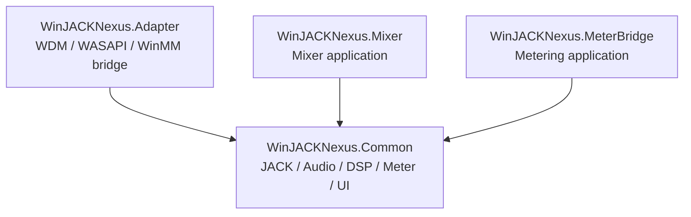

# WinJACKNexus Ref 模块合并计划书

> 文档状态：待审阅
>
> 目标：将 `ref/` 下已验证或可复用的实现纳入 WinJACKNexus，形成一个公用库和三个可独立运行的 APP：`Common`、`Adapter`、`Mixer`、`MeterBridge`。
>
> 当前实施范围：本文只负责 `WinJACKNexus.Common` 的 M0-M2 合并工作；Adapter、Mixer、MeterBridge 以及跨模块 M6 收尾任务分别记录在对应开发文档中。

## 1. 合并结论

本次合并不直接把两个 ref 工程作为子项目长期并存，而是按职责迁移代码、重新命名目标，并统一到顶层 `WinJACKNexus` 的 CMake 和命名空间约定中。

| 目标模块 | 来源 | 合并后的职责 |
|---|---|---|
| `WinJACKNexus.Common` | 当前 Common、`ref/Jack Meter Bridge` 的真实 JACK/计量实现、`ref/PureMixer` 的音频/DSP 基础和通用自绘控件 | 跨应用复用的实时音频能力、JACK 封装、DSP/计量数据模型、无锁数据交换、通用 JUCE 控件和主题 |
| `WinJACKNexus.Adapter` | 当前 Adapter，后续复用 Common 的 JACK/设备能力 | Windows WDM/WASAPI/WinMM 与 JACK 之间的设备桥接和设备管理界面 |
| `WinJACKNexus.Mixer` | `ref/PureMixer`，名称由 PureMixer 改为 Mixer | 面向用户的混音器应用、混音图配置、通道条界面、路由和混音器工作流 |
| `WinJACKNexus.MeterBridge` | `ref/Jack Meter Bridge` 的应用层、设置、历史和计量界面 | 独立运行的 JACK 输入监测、响度/峰值分析、历史曲线和 CSV 导出 APP |

`ref/Jack Meter Bridge` 拆分为两部分：已经可用的真实 JACK 流处理、计量算法和通用数据能力迁入 Common；原来的整窗界面、应用入口、设置、历史曲线、CSV 工作流和资源迁入独立的 `MeterBridge` APP。`MeterBridge` 直接使用 Common，但不依赖 Mixer 或 Adapter。

## 2. 已核实的现状

### 2.1 当前工程

- 顶层 CMake 已统一使用 C++20，并通过 `add_subdirectory(third_party/JUCE)` 集成 JUCE。
- 当前已有 `WinJACKNexus.Common` 静态库和 `WinJACKNexus.Adapter` GUI 应用。
- Common 已暴露 JUCE 和 `third_party/JACK2/include`，并链接 `libjack64.lib`；源码目前主要是版本、主题、LED 和单实例占位/基础实现。
- 既有命名空间约定为 `wjn::common` 和 `wjn::adapter`。

### 2.2 `ref/PureMixer`

`ref/PureMixer/CMakeLists.txt` 已将代码分成三类：

- `PureMixerCore`：`AudioEngine`、`NullAudioBackend`、`GainStage`、`LevelMeterProbe`、`Panner`、`MixerGraph`、`SoloMuteResolver`。
- `PureMixer`：`MainWindow`、`PureMixerApplication`、`MixerConsoleView`。
- `PureMixerEngineTests`：引擎 smoke tests。

因此它目前虽然是界面原型，但已经提供了可复用的音频后端抽象、DSP、混音图和测试入口。其真实 JACK 后端不能以 `NullAudioBackend` 代替，应由 Jack Meter Bridge 的 `JackClient` 能力补齐。

### 2.3 `ref/Jack Meter Bridge`

已确认的主要实现边界：

- `src/audio/JackClient.*`：JACK client 生命周期、端口和实时 process 回调。
- `src/audio/MeterEngine.*`：实时 Peak/RMS/响度相关计量处理。
- `src/audio/SilenceDetector.*`：静音阈值和持续时间判断。
- `src/history/HistoryTypes.h`：历史数据类型。
- `src/io/CsvLogWriter.*`：后台 CSV 记录。
- `src/presets/LoudnessPresetLibrary.h`：响度/真峰值预设。
- `src/settings/SettingsEditors.h`、`src/MainComponent.*`：应用级设置和完整 Meter Bridge 界面。

其中 `MeterEngine`、`JackClient`、`SilenceDetector`、历史数据和导出能力具备跨应用复用价值；`MainComponent.cpp` 中的 `MeterComponent`、`ChannelCard`、布局和对话框则需要拆分后再进入 Common，不能继续以单个超大应用组件的形式迁移。

## 3. 目标目录和模块边界

### 3.1 Common

目标目录建议如下：

```text
modules/WinJACKNexus.Common/include/WinJACKNexus/Common/
  Audio/
    AudioBackend.h
    AudioEngine.h/.cpp
    AudioSettings.h
    RealtimeTypes.h
    JackAudioBackend.h/.cpp
    JackClient.h/.cpp
    JackAudioInput.h/.cpp
    JackAudioOutput.h/.cpp
    JackPortGroup.h/.cpp
  MIDI/
    MidiTypes.h
    JackMidiInput.h/.cpp
    JackMidiOutput.h/.cpp
    MidiEventQueue.h/.cpp
  DSP/
    GainStage.h/.cpp
    Panner.h/.cpp
    Eq3Band.h
    ParametricEq.h
    LowCutFilter.h
    LevelMeterProbe.h/.cpp
    MeterEngine.h/.cpp
    SilenceDetector.h/.cpp
  Mixer/
    ChannelLayout.h
    ChannelStrip.h
    MixerGraph.h/.cpp
    SoloMuteResolver.h/.cpp
  Metering/
    MeterFrame.h
    HistoryTypes.h
    LoudnessPresetLibrary.h
  IO/
    CsvLogWriter.h/.cpp
    SpscRingBuffer.h
  Localization/
    LocaleManager.h/.cpp
    TextCatalog.h/.cpp
    LocaleTypes.h
  UI/
    MeterComponent.h/.cpp
    ChannelCard.h/.cpp
    MixerChannelStripComponent.h/.cpp
    ThemePackage.h/.cpp
    ThemeAssetCache.h/.cpp
    FontManager.h/.cpp
    Theme.h
    NexusLookAndFeel.h/.cpp
    AudioLed.h/.cpp
    MidiLed.h/.cpp
```

归入 Common 的代码必须满足至少一个条件：被 Adapter、Mixer 和 MeterBridge 共同使用、与具体窗口/产品流程无关，或代表稳定的实时音频/MIDI 数据契约。Common 不负责创建主窗口、不保存某个产品的窗口布局、不决定任何 APP 的业务交互。

Common 的 JACK 能力必须同时覆盖真实音频输入、真实音频输出、JACK MIDI 输入和 JACK MIDI 输出，不能只提供计量输入侧。所有 APP 都可以使用这些接口接入真实 JACK 数据进行开发和验收。

Common 预留统一的自定义主题包入口。主题包扩展名固定为 `.netheme`，本质是一个 ZIP 文件，包含主题 JSON 和图片/贴图资产；主题加载、解析、颜色覆盖、资源缓存和回退规则由 Common 提供，三个 APP 只选择主题并消费 Common 的主题上下文。

Common 内置并统一提供两套 LCD 专用字体：`LCD/zpix.ttf` 和 `LCD/DS-DIGI.TTF`。其中 zpix 用于通用 LCD 风格文本和控件读数，DS-DIGI 用于纯数显 LCD 场景。`Adapter`、`Mixer`、`MeterBridge` 默认通过 Common 使用这两套字体显示电平、状态、计时和硬件感控件内容；字体加载、字体族解析、缓存和回退由 Common 负责，APP 不得各自复制或注册字体。

### 3.2 Mixer

新增 `modules/WinJACKNexus.Mixer`，目标名和产品显示名统一为 `WinJACKNexus.Mixer` / `Mixer`：

```text
modules/WinJACKNexus.Mixer/
  CMakeLists.txt
  Source/
    Main.cpp
    App/
      MixerApplication.h/.cpp
      MixerMainWindow.h/.cpp
    Model/
      MixerProject.h/.cpp
      MixerViewState.h
    UI/
      MixerConsoleView.h/.cpp
      MixerMainComponent.h/.cpp
    Engine/
      MixerSession.h/.cpp
```

迁移自 `PureMixer` 的应用入口、窗口、混音器页面和用户交互进入 Mixer。Mixer 只依赖 Common，不再保留 `PureMixerCore` 这个独立 target，也不在 Mixer 内复制 `AudioEngine`、DSP 或电平计量实现。

### 3.3 MeterBridge

新增 `modules/WinJACKNexus.MeterBridge`，target 和 APP 名称统一为 `WinJACKNexus.MeterBridge` / `MeterBridge`：

```text
modules/WinJACKNexus.MeterBridge/
  CMakeLists.txt
  Resources/
  Source/
    Main.cpp
    App/
      MeterBridgeApplication.h/.cpp
      MeterBridgeMainWindow.h/.cpp
    Model/
      MeterProject.h/.cpp
      MeterChannelModel.h/.cpp
    UI/
      MeterBridgeMainComponent.h/.cpp
      MeterChannelCard.h/.cpp
      HistoryWindow.h/.cpp
      SettingsDialog.h/.cpp
```

迁移自 `ref/Jack Meter Bridge` 的 `Main.cpp`、`MainComponent.*`、设置编辑器、历史窗口/曲线、预设选择、CSV 操作和资源进入 MeterBridge。MeterBridge 的音频采集、MeterFrame、静音检测、历史数据和 CSV 底层能力全部通过 Common 使用；MeterBridge 的配置、窗口布局和应用工作流留在自身。

MeterBridge 是完整独立 APP，不是 Common 的 UI 示例，也不是 Mixer 的一个页面。它可以在不启动 Mixer 或 Adapter 的情况下连接 JACK 并完成监测。

### 3.4 Adapter

Adapter 保持现有模块名称和职责。迁移完成后：

- 设备枚举、WASAPI/WinMM 适配、设备节点和 Adapter 配置继续留在 Adapter 或 Common 中已有的 Windows 音频抽象中。
- JACK client、无锁队列、采样率/缓冲区契约等底层能力统一调用 Common。
- Adapter UI 继续使用 Common 的主题、LED 和通用控件，但不直接依赖 Mixer 的模型或页面。

## 4. 代码归属清单

### 4.1 直接迁入 Common，保留或小幅改名

| 来源 | 目标方向 | 处理 |
|---|---|---|
| `PureMixer/Source/Audio/AudioBackend.h` | `Common/Audio/AudioBackend.h` | 保留后端接口，统一 `wjn::common` |
| `PureMixer/Source/Audio/AudioSettings.h` | `Common/Audio/AudioSettings.h` | 与当前 Adapter 设置模型去重后保留一份 |
| `PureMixer/Source/Audio/RealtimeTypes.h` | `Common/Audio/RealtimeTypes.h` | 作为实时线程数据契约 |
| `PureMixer/Source/Audio/AudioEngine.*` | `Common/Audio/AudioEngine.*` | 统一输入、处理、输出的实时音频引擎边界 |
| `PureMixer/Source/DSP/*` | `Common/DSP/*` | 逐个检查实时安全和 JUCE 依赖 |
| `PureMixer/Source/Mixer/MixerGraph.*` | `Common/Mixer/*` | 保留图和路由的纯数据/处理部分 |
| `PureMixer/Source/Mixer/SoloMuteResolver.*` | `Common/Mixer/*` | 作为通用状态解析器 |
| `Jack Meter Bridge/src/audio/JackClient.*` | `Common/Audio/JackClient.*` | 与现有 JACK Bridge 设计合并，避免双重 client 抽象 |
| `Jack Meter Bridge/src/audio/JackClient.*` 的 JACK port/process 部分 | `Common/Audio/JackAudioInput.*`、`JackAudioOutput.*` | 从仅采集计量扩展为可注册 input/output ports；输出端在 process 回调中写入真实 JACK 输出 buffer |
| JACK2 `midiport.h` 相关能力 | `Common/MIDI/JackMidiInput.*`、`JackMidiOutput.*` | 注册 JACK MIDI input/output port，读取和发送真实 JACK MIDI 事件 |
| `Jack Meter Bridge/src/audio/MeterEngine.*` | `Common/DSP/MeterEngine.*` | 统一 MeterFrame 输出，供 Mixer/Adapter 订阅 |
| `Jack Meter Bridge/src/audio/SilenceDetector.*` | `Common/DSP/*` | 保留纯逻辑，回调和 UI 行为移出 |
| `Jack Meter Bridge/src/history/HistoryTypes.h` | `Common/Metering/*` | 作为快照/历史数据类型 |
| `Jack Meter Bridge/src/io/CsvLogWriter.*` | `Common/IO/*` | 保留后台写入能力，配置由调用方提供 |
| `Jack Meter Bridge/src/presets/LoudnessPresetLibrary.h` | `Common/Metering/*` | 预设定义和校验进入共享模型 |
| `PureMixer` / 当前 Common 的自绘 LED、主题、LookAndFeel | `Common/UI/*` | 合并颜色和绘制规范，保留现有 Common API 优先 |
| `Jack Meter Bridge/MainComponent.cpp` 中可独立的 Meter 绘制逻辑 | `Common/UI/MeterComponent.*` | 从窗口和卡片状态中拆出可复用控件 |
| 新增主题包加载与资源缓存 | `Common/UI/ThemePackage.*`、`ThemeAssetCache.*` | 读取 `.netheme` ZIP、解析主题 JSON、加载颜色和贴图，并向各 APP 提供统一主题上下文 |

### 4.2 迁入 Mixer，保留应用级逻辑

- `ref/PureMixer/Source/App/PureMixerApplication.*`
- `ref/PureMixer/Source/App/MainWindow.*`
- `ref/PureMixer/Source/UI/Views/MixerConsoleView.*`
- `PureMixer` 的混音器页面布局、通道条组合、快捷操作和界面状态。
- `PureMixer` 的 `NullAudioBackend`：仅作为 Mixer 的开发/测试后端，不作为 Common 的生产默认后端。

### 4.3 迁入 MeterBridge，保留应用级逻辑

- `ref/Jack Meter Bridge/src/Main.cpp`：迁移并改名为 `MeterBridge` 应用入口。
- `ref/Jack Meter Bridge/src/MainComponent.*`：拆分为 MeterBridge 主组件、通道卡片和历史入口。
- `ref/Jack Meter Bridge/src/settings/SettingsEditors.h`：保留 MeterBridge 的设置编辑界面；无 UI 配置模型按需下沉 Common。
- `ref/Jack Meter Bridge` 的历史曲线、通道/分组管理、响度预设选择、重置逻辑和 CSV 导出工作流。
- `ref/Jack Meter Bridge` 的图标和资源：归属 MeterBridge，不进入 Common。

### 4.4 暂不迁移或需单独评估

- `PureMixer` 中尚未接入真实设备的原型行为：先保留 Null backend，待 Common 的 JACK/Adapter 后端契约稳定后再接线。
- 与 VST2/VST3 SDK 相关内容：本次不纳入，除非后续明确提出插件宿主需求。

## 5. 关键设计决策

### 5.1 JACK 实现统一入口

Common 只保留一套 JACK 实现。优先以 `Jack Meter Bridge` 中已经可用的 `JackClient` 为行为基线，再适配当前 Common 的命名空间、生命周期和错误处理。Mixer、MeterBridge 和 Adapter 不直接链接或操作 JACK C API；所有 JACK 端口、回调、采样率和 buffer-size 处理通过 Common 接口完成。

Common 的 JACK 音频端口分为两种明确能力：

- `JackAudioInput`：注册 JACK 输出端口（`JackPortIsOutput`），在 process 回调中把真实输入数据写入 Common 预分配的接收 buffer，供 Mixer、MeterBridge 或 Adapter 消费。
- `JackAudioOutput`：注册 JACK 输入端口（`JackPortIsInput`），在 process 回调中把调用方准备好的音频 block 写入 JACK buffer，支持真实播放、监听和桥接输出；无数据时必须按 block 清零，避免输出旧数据。

输入和输出的端口数量、名称、通道布局和连接状态由控制线程管理；process 回调只处理已准备好的端口指针和 block，不在实时线程注册、注销或枚举端口。

### 5.2 JACK MIDI 双向实现

Common 同时提供 `JackMidiInput` 和 `JackMidiOutput`：

- 输入端注册 `JackPortIsInput | JACK_DEFAULT_MIDI_TYPE` 端口，在 process 回调中通过 `jack_midi_get_event_count` / `jack_midi_event_get` 读取当前 block 的 MIDI 事件。
- 输出端注册 `JackPortIsOutput | JACK_DEFAULT_MIDI_TYPE` 端口，在 process 回调开始时通过 `jack_midi_clear_buffer` 清空 buffer，再使用 `jack_midi_event_reserve` / `jack_midi_event_write` 写入待发送事件。
- MIDI 事件统一使用 Common 的 `MidiEvent` 数据契约，至少包含 `frameOffset`、payload、payloadSize 和时间戳/状态信息；控制线程与实时线程之间使用预分配的 SPSC 队列或等价无锁交换结构。
- 不允许在 JACK process 回调中创建 `std::vector`、分配 payload、等待锁或执行日志 I/O；超过预设事件容量时记录原子丢包计数，交由非实时线程报告。
- Adapter 的 WinMM/MIDI 设备适配和 Mixer 的 MIDI 控制映射可以建立在这组 Common JACK MIDI 接口之上，但 Common 不持有任何具体 APP 的控制映射和 UI 状态。

### 5.3 实时线程边界

JACK process 回调中禁止分配、加锁、文件 I/O、UI 调用和容器扩容。实时回调只负责读取输入 buffer、写入输出 buffer、读写 MIDI 事件和更新预分配的 MeterFrame，并通过无锁队列或原子快照把音频/MIDI/计量数据传给分析线程和 UI。结构变更在非实时线程准备完成后，于明确的 block 边界提交。

### 5.4 真实数据测试模式

Common 必须提供可直接用于真实数据测试的最小测试路径，不依赖某个 APP 的完整界面：

1. 音频输入输出回环：注册一组 JACK input/output ports，把输入 block 原样或经过可选增益后写入输出，验证真实 JACK 连接、通道数量、采样率和 block-size。
2. 音频输出测试源：提供控制线程配置的静音、固定电平或正弦测试源；测试源参数在 block 边界提交，不能在 process 回调动态分配。
3. MIDI 输入输出回环：收到 JACK MIDI 事件后按配置原样转发到 JACK MIDI output，保留 `frameOffset` 和 payload，便于用外部 MIDI 键盘、虚拟 MIDI 端口或 JACK MIDI 工具验证。
4. 端口状态监测：记录连接、断开、xrun、输入丢包、输出欠载和 MIDI 丢事件计数，状态通过原子快照提供给 UI/测试代码。
5. 最小独立测试工具或测试入口：在 Common 测试中支持无 UI 的 loopback；在具备 JACK 服务时执行真实端口集成测试，未运行 JACK 时只执行不依赖服务的单元测试。

### 5.5 Meter 数据契约

统一定义跨应用的 `MeterFrame`，至少覆盖 Peak、RMS、True Peak、Momentary/Short-term/Integrated LUFS 和 LRA 当前实现需要的字段。Common 只提供计算、快照和历史数据能力；显示量程、颜色和布局通过 `MeterComponent` 的配置传入，不把某个产品的窗口状态写入引擎。

### 5.6 自绘控件拆分

从 `Jack Meter Bridge/MainComponent.cpp` 拆出独立控件时，按“数据输入 + 绘制配置 + 交互回调”分离：

- 控件不持有 JACK client 或 MeterEngine 的所有权。
- 控件通过公开的 `setValue`/快照更新接口接收数据。
- Peak hold、量程、分段颜色、预设参考线等绘制策略可测试、可配置。
- ChannelCard 的应用级按钮行为通过回调注入，避免 Common 依赖 Mixer 或 Meter Bridge 的业务模型。

### 5.7 Common 默认现代化扁平控件风格

Common 的默认控件风格统一为现代化扁平风格，适用于当前控件和后续新增的所有自绘控件。三个 APP 不得各自定义一套基础控件视觉语言；新增控件必须优先复用 `NexusLookAndFeel`、Common 的主题 token 和通用绘制辅助函数。

默认规范如下：

- 以清晰的纯色块、细边框、明确的间距和状态色表达层级，避免拟物化高光、厚重内阴影、金属纹理和默认渐变。
- 控件几何结构保持简洁，默认圆角半径为 `0` 到 `4px`；除非控件语义确实需要，不使用大圆角胶囊和装饰性容器。
- 按钮、开关、滑块、旋钮、下拉框、标签、LED、电平表、通道条和卡片均使用统一的 hover、pressed、focused、disabled、selected 状态 token。
- 交互状态通过颜色、边框、透明度、短促的状态过渡和明确的焦点指示表达，不依赖立体浮雕或阴影制造可点击感。
- 文字层级、控件尺寸、内边距、边框宽度和颜色对比度由 Common 统一定义；LCD/zpix 和 DS-DIGI 只负责指定场景的文字/数字字形，不改变控件布局规则。
- 自绘电平表、LED 和波形/历史图表可以使用分段色块或线条表达数据，但背景、刻度、边框和状态叠加仍遵守扁平绘制规则。
- 贴图资产只作为控件的可替换纹理层或状态图层；贴图缺失、解码失败或主题未提供贴图时，必须回退到同一扁平风格的纯 JUCE 绘制，不回退到拟物化默认样式。
- 后续新增自绘控件必须提供无贴图基础绘制、主题 token 映射、禁用/聚焦状态和窄尺寸布局行为，才能进入 Common。

建议的 Common 默认 token：

```json
{
  "controls": {
    "defaultStyle": "flat",
    "button": { "style": "flat" },
    "toggle": { "style": "flat" },
    "slider": { "style": "flat" },
    "meter": { "style": "flat-segmented" },
    "channelStrip": { "style": "flat-panel" }
  },
  "metrics": {
    "panelRadius": 4,
    "borderWidth": 1,
    "controlHeight": 28,
    "controlPadding": 8,
    "focusRingWidth": 2
  }
}
```

### 5.8 用户界面中文标签规范

除专用名词外，整个套件的所有用户可见文字默认使用简体中文。未选择其他语言或语言资源不可用时，Common、Adapter、Mixer、MeterBridge 及后续新增模块均回退到 `zh-CN`。

默认中文文案覆盖以下内容：

- 按钮文字、菜单项、标签、标题、分组名和字段名。
- 工具提示、帮助文字、空状态、加载状态、连接状态和错误信息。
- 设置页、确认框、文件操作提示、历史曲线图例和导出提示。
- 电平表、通道条、设备卡片、MIDI 控件和主题管理界面中的普通说明文字。
- 测试模式和诊断界面中面向普通用户的操作提示；开发日志可以保留结构化英文代码标识，但不得直接作为用户界面文案。

可以保留原文的内容包括：

- 产品名和模块名：`WinJACKNexus`、`Adapter`、`Mixer`、`MeterBridge`、`Common`。
- 行业、协议和 API 专用名词：`JACK`、`MIDI`、`WASAPI`、`WinMM`、`LUFS`、`RMS`、`dBTP`、`JSON`、`ZIP`、`JUCE` 等。
- 源代码中的类名、函数名、变量名、CMake target、命名空间、文件路径、主题 token、字体逻辑 ID 和配置字段名。
- 文件扩展名和外部标准名称：`.netheme`、`.mixer`、`.meter`、`common:lcd-zpix`、`common:lcd-ds-digi` 等。
- 为避免歧义而必须保留的设备型号、驱动名称、外部端口名和用户自定义名称；必要时可以在中文说明后附原文。

Common 负责提供默认中文文案和统一文案查询入口，APP 只提供业务上下文和参数，不在各自控件中散落重复字符串。语言系统预留 `LocaleManager`/`TextCatalog`，语言文件扩展名固定为 `.lang`，文件内容使用 JSON，默认语言为 `zh-CN`。用户选择其他已提供的语言后，普通文案可以按对应语言显示；未找到翻译时按回退链使用中文文案。主题包可以覆盖颜色、尺寸、字体和贴图，但不负责决定语言。确需显示专用英文名词时，应通过专用名词白名单或明确的 `technicalName` 字段声明。

默认文案示例：

| 场景 | 默认中文文案 | 可保留的专用名词 |
|---|---|---|
| 添加设备 | 添加设备 | WASAPI、WinMM |
| 刷新列表 | 刷新列表 |  |
| 未连接 | 未连接 | JACK |
| 输入电平 | 输入电平 | Peak、RMS、LUFS、dBTP |
| 输出电平 | 输出电平 | Peak、RMS、LUFS、dBTP |
| MIDI 输入 | MIDI 输入 | MIDI |
| MIDI 输出 | MIDI 输出 | MIDI |
| 主题包 | 主题包 | `.netheme` |
| 加载失败 | 加载失败 | 具体错误中的 API/驱动名 |

默认中文界面审阅以“普通用户不需要阅读英文即可完成主要操作”为标准。迁移 `PureMixer` 和 `Jack Meter Bridge` 时，原有的英文按钮、菜单、提示和状态文案必须先纳入 `zh-CN.lang`；代码中的英文技术标识不属于此规则。其他语言通过独立 `.lang` 文件提供，不改变 `zh-CN` 默认回退要求。

#### 5.8.1 `.lang` 语言文件规范

`.lang` 是独立的 JSON 语言资源文件，不是主题包的一部分，也不使用 ZIP 容器。语言文件只保存语言元数据、普通用户文案、参数模板和允许保留的技术名词，不保存颜色、字体、贴图或控件布局。

建议的目录和文件组织如下：

```text
locales/
  zh-CN.lang
  en-US.lang
  Common/
    zh-CN.lang
  Adapter/
    zh-CN.lang
  Mixer/
    zh-CN.lang
  MeterBridge/
    zh-CN.lang
```

- `locales/zh-CN.lang` 提供全项目基础文案，是默认必备语言文件。
- `locales/en-US.lang` 作为可选语言示例或开发调试语言；不改变中文默认要求。
- `Common/zh-CN.lang` 提供通用控件、通用状态和通用错误文案。
- `Adapter/zh-CN.lang`、`Mixer/zh-CN.lang`、`MeterBridge/zh-CN.lang` 只提供对应 APP 的业务文案覆盖。
- 模块文案优先级为“当前 APP 模块语言文件 > Common 语言文件 > 内置中文默认值”；缺失键不得显示空白。

`.lang` 文件的 JSON 结构建议如下：

```json
{
  "schema": "WinJACKNexus.Language",
  "version": 1,
  "locale": "zh-CN",
  "displayName": "简体中文",
  "module": "Common",
  "fallbackLocale": "zh-CN",
  "technicalNames": {
    "jack": "JACK",
    "midi": "MIDI",
    "lufs": "LUFS",
    "dbtp": "dBTP"
  },
  "strings": {
    "common.action.confirm": "确认",
    "common.action.cancel": "取消",
    "common.action.close": "关闭",
    "common.status.loading": "正在加载",
    "common.status.notConnected": "未连接",
    "adapter.action.addDevice": "添加设备",
    "mixer.section.channelStrip": "通道条",
    "meterBridge.section.inputLevel": "输入电平"
  },
  "templates": {
    "common.status.connectedTo": "已连接到 {name}",
    "common.error.portOpenFailed": "无法打开端口：{name}"
  }
}
```

规则如下：

- `schema`、`version`、`locale`、`displayName`、`module` 和 `strings` 为必需字段；未知版本必须拒绝并回退，不支持的可选字段可以忽略。
- 文案键使用稳定的点分层 ID，建议以 `common.`、`adapter.`、`mixer.`、`meterBridge.` 开头；代码不直接使用中文文本作为查找键。
- `{name}` 等参数占位符必须在加载时校验，缺失参数、未知占位符或格式错误不得导致 APP 崩溃。
- 普通用户文案默认使用简体中文；用户选择其他语言后可以显示对应翻译；`technicalNames` 只用于 JACK、MIDI、LUFS、dBTP、驱动/API 名称等专用名词，不能用来绕过默认中文标签规则。
- `.lang` 文件解析、校验、切换和缓存只在非实时线程进行；音频/MIDI process 回调不得查询文件、解析 JSON 或触发 UI 刷新。
- 语言切换在消息线程提交，成功加载完整的 `TextCatalog` 后再通知组件刷新；刷新失败时继续使用上一份有效语言目录。
- APP 配置只保存当前语言区域和语言文件路径/资源 ID，不复制语言 JSON 内容。

### 5.9 `.netheme` 自定义主题包

#### 5.9.1 包格式

`.netheme` 是一个 ZIP 容器，不执行其中的代码，只提供主题 JSON 和图片/贴图资产。建议的包结构如下：

```text
StudioDark.netheme
  manifest.json
  Common/
    theme.json
    assets/
      panel-background.png
      meter-segments.png
      led-audio-on.png
  Adapter/
    theme.json
    assets/
      device-card.png
      device-status.png
  Mixer/
    theme.json
    assets/
      channel-strip.png
      fader-cap.png
      pan-knob.png
  MeterBridge/
    theme.json
    assets/
      meter-card.png
      history-grid.png
```

- `manifest.json` 是主题包入口，包含格式标识、版本、主题 ID、显示名称、作者、默认模块和资源索引。
- `Common/theme.json` 定义基础色板、字体/尺寸 token、通用控件样式和默认贴图；它是所有 APP 的基础主题。
- 项目默认 LCD 字体不依赖主题包，固定由 Common 从 `LCD/zpix.ttf` 提供；主题包可以通过字体 token 覆盖，但必须保留 zpix 作为缺失或加载失败时的全局回退。
- 项目默认纯数显字体不依赖主题包，固定由 Common 从 `LCD/DS-DIGI.TTF` 提供；主题包可以通过 `numericLcd` token 覆盖，但必须保留 DS-DIGI 作为缺失或加载失败时的纯数显回退。
- `Adapter/theme.json`、`Mixer/theme.json`、`MeterBridge/theme.json` 只定义对应 APP 的覆盖项和模块专属控件样式，可以引用自身目录和 `Common/assets/` 下的资源。
- 图片资产统一放在对应模块的 `assets/` 目录，路径使用 ZIP 内相对路径，大小写和扩展名必须与 JSON 一致。
- 未提供模块目录或模块字段时，使用 Common 基础主题；未提供某个颜色、尺寸或贴图时，逐级回退到 Common 默认值，再回退到代码内置值。

#### 5.9.2 主题 JSON 内容

主题 JSON 使用稳定的语义 token，不让 APP 直接依赖具体控件类名。至少支持：

```json
{
  "schema": "WinJACKNexus.Theme",
  "version": 1,
  "colors": {
    "darkCanvas": "#121316",
    "rackPanel": "#1A1C23",
    "primaryText": "#E6E8EE",
    "border": "#2A2D3A",
    "accent": "#3B82F6",
    "meterNormal": "#10B981",
    "meterWarning": "#F59E0B",
    "meterClipping": "#EF4444"
  },
  "metrics": {
    "panelRadius": 4,
    "controlHeight": 28,
    "meterGap": 4
  },
  "fonts": {
    "ui": "common:lcd-zpix",
    "heading": "common:lcd-zpix",
    "lcd": "common:lcd-zpix",
    "numericLcd": "common:lcd-ds-digi"
  },
  "assets": {
    "panelBackground": "assets/panel-background.png",
    "meterSegments": "assets/meter-segments.png"
  },
  "controls": {
    "defaultStyle": "flat",
    "meter": { "style": "flat-segmented" },
    "channelStrip": { "style": "flat-panel" }
  }
}
```

颜色值使用 `#RRGGBB` 或 `#AARRGGBB`；数值 token 由 Common 做范围校验；字体只允许系统字体、Common 内置的 `LCD/zpix.ttf`、`LCD/DS-DIGI.TTF` 或主题包中已声明的静态字体资源，不允许主题包加载可执行字体代码。控件通过语义 token 查询颜色、尺寸和贴图，缺失 token 不应导致 APP 启动失败。

字体约定：Common 为 `LCD/zpix.ttf` 分配稳定的逻辑 ID `common:lcd-zpix`，为 `LCD/DS-DIGI.TTF` 分配稳定的逻辑 ID `common:lcd-ds-digi`，加载后缓存 `juce::Typeface`/字体对象。主题 JSON 可以把 `ui`、`heading`、`lcd` 或 `numericLcd` 指向主题包内的字体资源，但主题覆盖只影响视觉层，不能改变音频/MIDI 处理。字体文件缺失、损坏、格式不支持或字体注册失败时，Common 必须按字体用途分别回退到对应内置字体，再回退到系统字体，并报告非实时诊断状态。

#### 5.9.3 Common API 和职责

Common 预留以下能力，具体类名可在实现阶段调整但职责不变：

- `ThemePackage`：打开 `.netheme`、读取 manifest、解析模块主题 JSON，并报告格式/资源错误。
- `ThemeContext`：提供合并后的颜色、尺寸、字体和控件样式 token；按 `Common` 基础值和 APP 模块覆盖值计算最终结果。
- `ThemeAssetCache`：按包 ID、模块和资源路径缓存解压后的 JUCE `Image`/二进制资源，避免每次 repaint 重新读取 ZIP。
- `FontManager`：加载和缓存 Common 内置的 `LCD/zpix.ttf` 与 `LCD/DS-DIGI.TTF`，解析主题包声明的字体覆盖，并提供 `common:lcd-zpix`、`common:lcd-ds-digi` 两个稳定逻辑 ID 和用途对应的回退。
- `NexusLookAndFeel`：从 `ThemeContext` 应用颜色、字体、尺寸和可替换图片；主题切换后在消息线程刷新组件。
- `ThemePackageManager`：负责当前主题、默认主题、加载失败回退和配置持久化；不把 ZIP 文件路径散落到各 APP。

主题包加载、ZIP 解压、JSON 解析和图片解码只能发生在非实时线程。JACK process 回调和音频/MIDI 实时路径不得访问主题文件、锁定资源缓存或触发组件重绘。

#### 5.9.4 APP 使用规则

- Adapter、Mixer、MeterBridge 各自声明模块 ID，并从 Common 获取 `Common + 当前模块` 的合并主题上下文。
- APP 配置文件只保存当前主题包路径、主题 ID、启用状态和必要的版本信息，不复制整个主题 JSON。
- 主题切换在消息线程完成；新主题准备成功后原子替换 `ThemeContext`，再通知窗口和控件刷新。
- 主题包不改变音频/MIDI 路由、计量算法、项目数据和 JACK 端口命名；视觉配置与运行逻辑严格分离。
- 模块主题可以替换控件背景、旋钮/推子帽、LED、Meter 背景和历史网格等图片资产，但必须提供无贴图时的纯 JUCE 绘制回退。
- 三个 APP 默认共享 `common:lcd-zpix`；纯数显控件默认共享 `common:lcd-ds-digi`。模块主题可以为专用标题或品牌区域指定其他已声明字体，但数值型 LCD 控件默认继续使用 DS-DIGI，除非模块明确覆盖 `numericLcd` token。

#### 5.9.5 校验和安全边界

- ZIP 内路径必须是相对路径，拒绝 `..`、绝对路径、重复路径和解压目录逃逸。
- 限制压缩包总大小、单个文件大小、图片像素尺寸、JSON 深度和资源数量，避免加载异常包耗尽内存。
- 只接受声明的 JSON 字段和支持的图片格式；未知字段可忽略，未知必需版本应拒绝并回退默认主题。
- 解压目录使用应用缓存目录中的随机/隔离子目录，加载完成后由 Common 统一清理。
- 主题包错误只影响主题加载，不得阻止 APP 启动；错误通过非实时诊断状态提供给 UI 或日志系统。
- 字体文件同样受大小、格式和资源路径校验；`LCD/zpix.ttf` 与 `LCD/DS-DIGI.TTF` 作为 Common 内置资源参与构建/安装，并保留各自许可证或来源说明。

## 6. 实施阶段

> 本文只保留 Common 的 M0-M2。后续阶段文档索引：
>
> - M3 Mixer：`WinJACKNexus.Mixer_开发计划书.md`
> - M4 MeterBridge：`WinJACKNexus.MeterBridge_开发计划书.md`
> - M5 Mixer 真实 JACK 流：`WinJACKNexus.Mixer_开发计划书.md`
> - M6 跨模块收尾：`WinJACKNexus_M6_收尾计划.md`

### M0：基线与依赖确认

1. 锁定当前 Adapter/Common 可构建基线。
2. 确认 `third_party/JUCE`、`third_party/JACK2` 的链接和运行时 DLL 部署规则。
3. 记录两个 ref 工程中已通过的 Meter、SilenceDetector 和 PureMixer engine 测试。
4. 确认 `LCD/zpix.ttf`、`LCD/DS-DIGI.TTF` 的字体格式、字体族名称、授权/来源说明和安装/打包位置。
5. 确定 `.lang` 的 JSON schema、UTF-8 编码、支持的语言区域列表、语言文件安装位置和翻译维护责任。
6. 明确源文件许可证和资源许可，迁移时保留必要的许可说明，不把第三方源码误并入项目代码。

### M1：Common 音频与 JACK 能力合并

1. 先迁移 JACK client 和实时数据类型，建立 Common 的最小可编译接口。
2. 实现 `JackAudioInput` 和 `JackAudioOutput`，打通真实 JACK 音频输入、处理和输出链路；输出无数据时清零 block。
3. 实现 JACK MIDI 输入和输出，加入预分配 MIDI 事件队列、frame offset 保留和丢事件计数。
4. 迁移 `AudioBackend`、`AudioEngine`、`LevelMeterProbe` 和 `MeterEngine`。
5. 合并 `SpscRingBuffer`/FIFO 传递和采样率、buffer-size、xrun 生命周期。
6. 迁移 `SilenceDetector`、历史类型、响度预设和 CSV writer。
7. 将 Adapter 现有 JACK/音频代码改为调用 Common，删除重复的底层实现。

验收：Common 单元测试通过；在 JACK 服务运行时可建立 client、接收真实音频 block、输出真实音频 block、接收和发送 MIDI 事件，并且断开/重连、采样率变化和 buffer-size 变化不会破坏生命周期。

### M2：Common 自绘控件合并

1. 从 Meter Bridge 的 `MeterComponent` 提取独立头/源文件。
2. 从 PureMixer 和当前 Common 合并 Theme/LookAndFeel/LED 绘制规则。
3. 实现 `ThemePackage`、`ThemeContext`、`ThemeAssetCache` 和主题包管理入口，支持 `.netheme` ZIP 的 manifest、Common 基础主题和模块覆盖主题。
4. 实现 `FontManager`，将 `LCD/zpix.ttf` 注册为 `common:lcd-zpix`，将 `LCD/DS-DIGI.TTF` 注册为 `common:lcd-ds-digi`，并接入三个 APP 的默认 `NexusLookAndFeel`。
5. 提取通用 ChannelCard/ChannelStrip 视觉骨架，业务按钮使用回调。
6. 将所有现有控件和后续新增自绘控件接入 Common 的现代化扁平默认风格，统一状态 token、间距、边框、焦点环和无贴图绘制路径。
7. 将 Adapter、Mixer、MeterBridge 的 `NexusLookAndFeel` 接入 `Common + 模块` 主题合并结果。
8. 在 Common 中实现 `.lang` JSON 解析、schema 校验、`LocaleManager`/`TextCatalog`、Common 基础目录和 APP 模块覆盖，迁移三个 APP 的普通按钮、标签、提示、错误和状态文案。
9. 增加语言区域切换、回退链、参数占位符校验、缺失键诊断和不可用语言文件回退；确保加载和切换不进入音频/MIDI 实时线程。
10. 为无信号、静音、过载、Peak hold、窗口窄尺寸、主题切换、缺失资产回退、zpix 字体加载失败、DS-DIGI 纯数显回退和中文文案完整性等状态补充控件级测试或最小手工验收场景。

验收：Common 不依赖任何具体应用入口；三个 APP 都可以加载同一个 `.netheme`，并分别应用 Common 基础样式和自身模块覆盖；三个 APP 默认使用 `LCD/zpix.ttf`，纯数显控件默认使用 `LCD/DS-DIGI.TTF`；现有和新增自绘控件默认均为现代化扁平风格；未选择其他语言时，除白名单专用名词外的用户可见普通文案均为简体中文；选择其他语言后按对应 `.lang` 文件显示并按规则回退；`.lang` 文件可以完成 JSON 校验、Common/模块覆盖、参数替换、缺失键回退和语言切换；主题加载/切换、字体解码和文案读取不触碰 JACK 音频/MIDI 实时线程。

## 7. 依赖方向



  禁止方向：Common 依赖 Adapter、Mixer 或 MeterBridge；三个 APP 之间不互相依赖，不共享彼此的窗口、模型或产品工作流；所有跨 APP 的音频、JACK、计量和通用 UI 能力只能经 Common 提供。

## 8. 测试与验收矩阵

| 范围 | 验证内容 |
|---|---|
| 编译 | `scripts/configure.cmd`、`scripts/build.cmd` 通过，MSVC UTF-8 与 JUCE 9 target 配置正常 |
| Common 单测 | MeterEngine、SilenceDetector、DSP、Solo/Mute、历史 ring buffer、配置数据校验 |
| Common 主题单测 | manifest/主题 JSON 解析、颜色和尺寸校验、Common/模块覆盖合并、缺失字段回退、无效资源处理 |
| Common 字体单测 | `LCD/zpix.ttf` 和 `LCD/DS-DIGI.TTF` 加载、`common:lcd-zpix`/`common:lcd-ds-digi` 解析、字体缓存、主题字体覆盖、字体损坏时按用途回退 |
| Common 控件风格单测 | 默认 `flat` token、状态切换、焦点环、尺寸/圆角边界、无贴图纯 JUCE 绘制回退和新增控件基类约束 |
| Common 文案单测 | `.lang` JSON/schema 校验、UTF-8、`zh-CN` 文案查询、Common/模块覆盖、参数占位符、专用名词白名单、缺失文案回退和普通英文文案扫描 |
| Common 语言切换集成 | 语言切换、无效文件回退、上一份有效目录保留、消息线程刷新和实时线程隔离 |
| Mixer 单测 | MixerGraph 路由、通道布局、增益/声像、空后端 smoke test |
| MeterBridge 单测 | MeterFrame 展示适配、通道/分组模型、静音重置、历史窗口数据和 CSV 配置 |
| JACK 音频集成 | client 激活/停用、输入/输出端口注册、真实音频 block、音频回环/测试源、xrun、采样率/缓冲区变化、重连 |
| JACK MIDI 集成 | MIDI input/output 端口注册、事件读取/发送、frame offset、回环、事件容量上限和丢事件计数 |
| UI 手工验收 | 控件无数据、正常电平、过载 peak hold、窄窗口、横向滚动、历史和 CSV 操作 |
| 扁平风格验收 | Adapter、Mixer、MeterBridge 的按钮、开关、滑块、旋钮、LED、电平表、卡片和后续自绘控件保持统一 flat 视觉；无高光拟物、厚重阴影或不一致圆角 |
| 中文界面验收 | 未选择其他语言时，三个 APP 的按钮、标签、菜单、提示、状态、错误、设置和图例除专用名词外默认使用简体中文；迁移自 ref 的英文普通文案必须纳入语言文件，不得绕过文案查询入口 |
| 主题包验收 | `.netheme` ZIP 加载、Common 基础主题、Adapter/Mixer/MeterBridge 模块覆盖、颜色替换、贴图替换、主题切换和默认样式回退 |
| LCD 字体验收 | 三个 APP 的通用 LCD 控件默认使用 `LCD/zpix.ttf`，纯数显控件默认使用 `LCD/DS-DIGI.TTF`；字体加载失败时仍能启动并按用途回退 |
| 主题包安全 | 路径逃逸、重复路径、超大 ZIP、超大图片、JSON 深度/资源数量限制和不支持版本均被拒绝并回退 |
| 独立运行 | Adapter、Mixer、MeterBridge 均可单独启动、单独关闭，不要求其他 APP 同时运行 |
| 真实数据测试 | 使用 jackd、JACK 音频端口和 JACK MIDI 端口完成 Common 的音频回环、真实输出、MIDI 回环和外部设备输入输出测试 |
| 并行运行 | Adapter、Mixer 与 MeterBridge 同时运行时，JACK client/port 命名、线程生命周期和资源释放正确 |

## 9. 主要风险和处理方式

| 风险 | 处理方式 |
|---|---|
| 多个 APP 的 JACK 生命周期互相冲突 | 以 Common 保留唯一 JACK 实现，迁移后 Adapter/Mixer/MeterBridge 只依赖接口；每个 APP 管理自己的 client 实例 |
| 音频输出或 MIDI 事件在实时线程中失真/丢失 | 采用预分配输出 buffer、MIDI 事件队列和原子计数；通过真实 JACK 回环与外部 MIDI 设备测试验证，不把 UI 更新放入 process 回调 |
| 主题包资源阻塞实时线程或导致界面崩溃 | ZIP/JSON/图片全部在非实时线程解析和缓存；资源错误使用逐级回退，控件始终保留纯 JUCE 绘制路径 |
| 不同 APP 的主题 token 相互污染 | 使用固定模块 ID 和 `Common -> APP` 的单向覆盖规则，禁止 APP 反向修改 Common 基础 token |
| 新增控件风格分裂 | 将 flat 作为 Common 的默认基类/LookAndFeel 约束，并把风格 token、状态和无贴图回退纳入控件验收；APP 不得绕过 Common 自建基础控件皮肤 |
| 默认文案缺失或错误使用英文 | 由 Common 维护 `zh-CN.lang`、专用名词白名单和稳定文案键，新增/迁移控件必须经过 `.lang` 完整性检查、文案扫描和默认中文界面验收 |
| `.lang` 文件损坏或翻译占位符不一致 | 解析时执行 schema、UTF-8 和占位符校验；失败时保留上一份有效目录并沿回退链查找，不得显示空白或阻止 APP 启动 |
| 语言资源进入实时路径 | `LocaleManager` 只在消息线程加载并以不可变 `TextCatalog` 快照供 UI 使用，JACK process 回调禁止访问文件、JSON 和语言缓存 |
| `.lang` 与 `.netheme` 资源边界混乱 | 两者保持独立加载和缓存；主题包只负责视觉资源，语言区域由 Common 配置和 `.lang` 资源决定 |
| LCD 字体授权、打包或加载失败 | M0 核对 `LCD/zpix.ttf`、`LCD/DS-DIGI.TTF` 来源和授权；M2 由 Common 统一打包和缓存，并按字体用途保留内置字体及系统字体回退 |
| PureMixer 的 DSP 与 Meter Bridge 的计量模型重复 | 先统一 `MeterFrame`、采样率和 block-size 契约，再合并算法；不按文件名强行覆盖 |
| 自绘控件携带应用状态 | 把数据、绘制配置、业务回调拆开，控件不拥有引擎 |
| JACK 回调中出现分配或锁 | M1 建立实时线程约束和测试/代码审查门槛，结构变化走预构建快照 |
| JUCE target/版本差异 | 沿用顶层 JUCE 9 target 和 C++20；不复制 ref 工程各自的 `add_subdirectory` |
| Windows 延迟加载与 DLL 部署差异 | 以当前 Common 的 `libjack64.lib` 链接约定为准，单独验证运行时 DLL 与 jackd 环境 |
| ref 代码许可或资源不可直接合并 | M0 逐项核对许可证和资源来源，必要时重绘或替换资源 |
| 过早删除可用参考实现 | M5 前保留 ref，使用迁移后的测试和手工验收结果作为删除条件 |

## 10. 本计划明确不做的事

- 不把所有 UI 代码都塞入 Common；窗口、页面、配置流程和产品工作流仍属于应用层。
- 不在本次计划中引入 VST2/VST3 插件宿主。
- 不在真实 JACK 后端完成前删除 `NullAudioBackend`；它保留为开发和测试替身。
- 不因合并计划顺手重做 Adapter 的既有界面和设备功能。

## 11. 审阅后需要确认的决策

1. `Mixer` 的最终 target 名是否采用 `WinJACKNexus.Mixer`，还是仅采用 `WinJACKNexus.MixerApp`。
2. `MeterBridge` 的最终 target 名是否采用 `WinJACKNexus.MeterBridge`，产品显示名是否保持 `MeterBridge`。
3. Common 中 `Metering` 与 `DSP` 的目录边界是否按本计划执行。
4. Mixer 项目配置是否沿用独立 `.mixer` JSON 格式，MeterBridge 是否继续使用独立 `.meter` 配置。
5. `.netheme` 的 manifest/主题 JSON schema 版本是否由 WinJACKNexus 统一维护，以及是否需要主题签名/哈希校验。
6. 是否在 Common 中提供统一的 JACK client 基类，以便三个 APP 共用生命周期约定。
